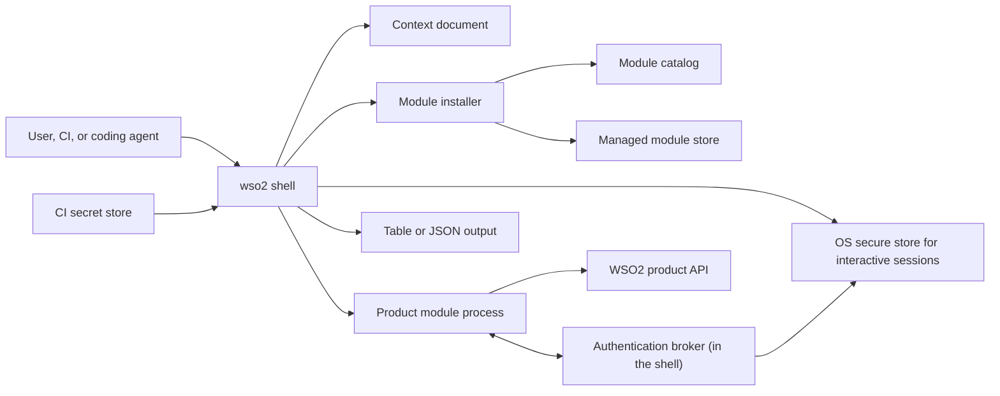
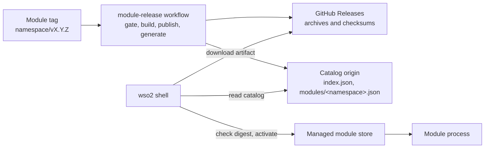

# WSO2 CLI architecture

**Related:** [Product requirements](product-requirements.md),
[decision records](adr/), [reference](reference/)

This document describes the architecture as built. Where a part of the
original design is not built, the section says so.

## 1. Design summary

The `wso2` CLI is a Go shell with a managed module runtime. Each product
module is an independently versioned native executable. The shell resolves
modules from a local versioned store it manages and launches them out of
process.

The architecture is **SDK-first hybrid**:

- execution stays out of process, so modules release independently and there
  is no Go plugin ABI coupling;
- every module implements one mandatory contract;
- a shared Go SDK hides the process protocol and supplies common
  authentication, context, help, output, and error behavior.

The design does not copy kubectl's `PATH` discovery. It takes Krew's
versioned-store and receipt ideas and adds a shell-owned store,
digest-checked artifacts, protocol and platform gates, and a generated
catalog.

The command name is chosen at build time (`CLI_NAME`, release default `ws`).
The shell's own text is written with `wso2` and renamed as it is rendered, so
this documentation uses `wso2` throughout.

## 2. Principles

1. **The shell owns policy; products own workflows.**
2. **One top-level product namespace maps to one official module.**
3. **Common behavior is implemented once, in the SDK and the shell.**
4. **Modules release independently of the shell.**
5. **Installed state is explicit and receipt-backed.**
6. **The active installation changes only after verification succeeds.**
7. **Long-lived credentials never reach a module.**
8. **Process isolation is not a security sandbox.**
9. **Automation never depends on terminal formatting or implicit network
   access.**

## 3. System context



## 4. Components

### 4.1 Shell

The shell owns:

- its own commands, which always take precedence over product namespaces;
- argument parsing and dispatch to a product namespace;
- context selection and the context document;
- authentication, sessions, and secure credential storage;
- module install, update, list, and remove;
- help, version, diagnostics (`wso2 doctor`), and completion;
- invocation policy such as `--no-input`.

Shell commands today: `context`, `login`, `logout`, `org`, `product`,
`whoami`, `completion`, `config`, `doctor`, `help`, and `version`. The
[command reference](reference/commands.md) is authoritative.

The shell stays small enough that a product command change never needs a
shell release.

### 4.2 Module installer and store

`internal/install`, `internal/modules`, and `internal/catalog` resolve a
release from the catalog, download it, check its size and digest, extract it
safely, write a receipt, and switch the active version atomically. They never
parse product commands or store product credentials.

### 4.3 Module catalog

The catalog is two JSON files generated from the module tags that exist and
served over HTTPS from the origin that serves the install scripts. It is a
build output, not curated metadata, and holds no executables. The
[module catalog reference](reference/module-catalog.md) describes the files,
selection, channels, pins, and generation.

### 4.4 Product module

A product module:

- owns one top-level namespace;
- implements product resources, actions, validation, and API calls;
- uses the SDK for the contract and common behavior;
- ships as a platform-specific archive;
- updates without a shell rebuild.

Modules are trusted WSO2 software. A separate process isolates failures and
release cycles; it does not restrict what the module can reach as the user.

### 4.5 Go SDK

The SDK (`sdk/`, a separate public Go module) is the author-facing interface.
Authors do not see the wire protocol.

```go
func main() {
    module.Serve(ctx, module.Options{
        Namespace:     "api",
        Version:       version,
        AuthAudiences: []string{"api-platform"},
    }, commands...)
}
```

A Cobra module uses `cobratree`, which fills the declared command tree from
the tree it serves. The SDK supplies the handshake, the command-tree
declaration, the broker client, typed results and problems, and a test kit
(`sdk/testkit`). The shell owns rendering and the problem-to-exit-code
mapping. See the [module SDK reference](reference/module-sdk.md).

### 4.6 Authentication broker

The shell owns authentication and every long-lived credential. A module asks
for access over its own standard input and output (`AcquireAccess`), and the
shell answers with `AccessGranted` or `AccessDenied`. There is no local port.

The broker:

- checks the request against the audiences and scopes the module's receipt
  declares;
- resolves the selected context and the product's session;
- refreshes, exchanges, or mints access without exposing refresh tokens or
  client secrets;
- returns short-lived access bound to the product's audience and scopes, and
  refuses rather than issuing broader access when narrowing is unavailable.

One login serves several products through **one session per product**, each
obtained from the provider's browser sign-on by one of the strategies
`direct`, `derived`, `federated`, `exchanged`, or `sibling`; a
client-credentials context mints access `inline` per command with no session.
See [ADR 0005](adr/0005-audience-side-verification.md),
[ADR 0014](adr/0014-one-login-one-session-per-product.md), and
[ADR 0010](adr/0010-best-effort-revocation-on-session-end.md) for revocation.

Authentication kinds are `oauth-browser` (Authorization Code with PKCE),
`oauth-device` (Device Authorization Grant, chosen with
`wso2 context create --device`), and `client-credentials`, whose secret is
read from a named environment variable. `pat` is legal in the document and
refused at use with `auth.kind_not_implemented`.

CI is non-interactive. Browser and device logins refuse under `--no-input` or
`WSO2_NO_INPUT`. Client credentials need no `wso2 login`: the shell performs
the exchange inline, and the secret never leaves the shell process.

### 4.7 Contexts

A **context** owns its login block, its products, and a credential reference
its sessions live under. No two contexts share a reference
([ADR 0016](adr/0016-a-context-owns-its-login-and-sessions.md)). Several
organizations reached through one login are one context, switched with
`wso2 org use`.

- The context document (`contexts.json`) is complete: values a product
  descriptor supplies are frozen into the record when it is created or
  applied, and nothing is derived at command time.
- `wso2 context apply -f` turns a short shareable input file into complete
  records. An input file never names a credential reference or a selection.
- Selection order: `--context`, then `WSO2_CONTEXT`, then the selected
  context, else a typed refusal when a command needs access. Selecting never
  authenticates and never reaches the network.
- **Writing a context grants nothing**
  ([ADR 0012](adr/0012-writing-a-context-or-identity-grants-nothing.md)): the
  document has no field that can hold a credential, and a created or applied
  context yields an authentication refusal until someone logs in.
- A stored session records its issuer, client, scopes, resource, and
  audience, and is presented only for a record that still asks for exactly
  those.

The [context file reference](reference/context-file.md) has the schema and
examples.

### 4.8 Output and problems

Handlers return typed values: a `Result` (fields, columns, rows) or a
`Problem` (category, code, message, recovery). The shell renders `table` or
`json` and maps the problem category to an exit code. Diagnostics go to
standard error; results go to standard output. See
[ADR 0003](adr/0003-shell-owned-output.md) and the
[module SDK reference](reference/module-sdk.md#returning-a-failure).

## 5. Module contract

The shell and a module exchange length-delimited Protobuf envelopes
(`sdk/proto/wso2/cli/module/v1/contract.proto`) over the module's inherited
standard input and output. Module standard output carries frames only;
module standard error carries bounded diagnostics; only the shell writes
user-facing output ([ADR 0002](adr/0002-module-transport.md)).

### 5.1 Hello

The module opens with `Hello`, which carries:

- `module`: namespace, module version, and SDK version;
- `protocol_versions`: the contract versions it speaks, newest first;
- `required_capabilities`: protocol behaviors it cannot run without.

The shell checks the namespace and version against the receipt, refuses any
required capability it does not provide, and confirms the module speaks the
protocol version chosen at resolution. It then answers with `Welcome`,
carrying the chosen protocol version and the shell's version and platform,
and mints the invocation ID every later message repeats. A mismatch is a
`module_trust` problem.

### 5.2 Command-tree declaration

A module declares its command tree (commands, flags, and which flags take a
value). The shell asks for it once, at install, by running the unpacked
executable with `WSO2_MODULE_COMMAND_TREE` set, and records the answer in the
receipt. The shell parses a product command line only from that receipt,
never from the catalog's copy
([ADR 0013](adr/0013-a-command-tree-is-parsed-only-from-the-local-receipt.md)).
A module with no declared tree is parsed by the older rule: leading plain
words are the command, and everything from the first unknown flag goes to the
module.

There is no separate health message. The install-time declaration run and the
launch handshake are the checks that an executable starts and speaks the
contract.

### 5.3 Invocation

1. The shell parses its own flags and identifies the product namespace.
2. It resolves the active receipt and rechecks the executable's digest.
3. It selects the context and prepares the broker for this invocation.
4. It launches the module with a sanitized environment built from nothing
   (`internal/modules/environment.go`).
5. `Hello` / `Welcome` complete the handshake.
6. The shell sends one `Invoke` with the command path, arguments, output
   mode, and policy.
7. The module may send `AcquireAccess` any number of times.
8. The module ends with one `Result` or `Problem`, and the shell renders it
   and exits with the mapped code.

## 6. Release and publishing

One repository holds the shell, the SDK, and every product module
([ADR 0006](adr/0006-monorepo-modules-and-generated-catalog.md)). Tags
separate the three:

- the shell uses `v*` and publishes platform archives;
- the SDK uses `sdk/v*` and publishes the `sdk/` Go module
  ([ADR 0009](adr/0009-sdk-versioning-and-publication.md));
- a module uses `<namespace>/v<version>` and may carry its product's own
  version scheme. Build metadata is refused.

A module tag push runs the release gate, builds one archive per platform,
publishes them to GitHub Releases, regenerates the catalog from every module
tag, and deploys it. Generation is deterministic. A release is refused when
the module's protocol versions do not intersect what the released shell
speaks, so the shell always ships first.



Details: [module catalog](reference/module-catalog.md),
[release artifacts](reference/release-artifacts.md),
[module manifest](reference/module-manifest.md). A developer installs an
unpublished module through a local development origin
([ADR 0011](adr/0011-local-module-install-through-a-development-origin.md)).

## 7. Installation and activation

### 7.1 What is built

`wso2 product install <product>[@<version>]`:

1. reads the catalog index, then the namespace file;
2. selects the newest version the channel or pin permits whose protocol
   versions intersect the shell's and which publishes an artifact for this
   platform;
3. downloads the archive and checks its size and SHA-256;
4. extracts it into a staging directory, rejecting absolute paths,
   traversal, links and other special entries, and archives past the entry
   or size limit;
5. runs the executable once to read its command tree;
6. writes the receipt and atomically updates `active.json`.

Any failure before the last step leaves the previous active version in
place. `@<version>` pins the module; `wso2 product update` passes a pinned
module over. `wso2 product list` reads the catalog index on request and
reports installed versions, channels, and available updates. `wso2 product
remove` deletes a module.

Every launch rechecks the executable against the digest in its receipt.
Performance work must not replace that check with file timestamps.

### 7.2 Not built

- rollback to a retained version, and a `verify` command;
- background catalog refresh and update notices after other commands;
- automatic install of a missing module on first use (`wso2 context create`
  installs a missing login product unless `--no-install`);
- revocation;
- offline bundles and `.wso2module` files (deferred; their signed trust model
  must be reconciled with section 9.2 first);
- mirrors.

## 8. Storage layout

```text
$WSO2_HOME (default ~/.wso2)/
  cli/
    contexts.json          context document
    contexts.json.lock
    preferences.json       shell preferences (wso2 config)
    locks/<ref>.lock       per-context session rotation locks
    modules/
      <namespace>/
        active.json        exact active version and receipt digest
        policy.json        channel and pin
        versions/
          <version>/
            receipt.json
            <executable>
```

`active.json` is a state file rather than a symlink so behavior matches on
Windows. Session rotation takes an OS advisory lock
([ADR 0007](adr/0007-os-advisory-lock-for-session-rotation.md)). No
credential is stored in this tree; sessions live in the OS secure store under
the context's credential reference.

## 9. Security model

### 9.1 Threats in scope

- corrupted or substituted downloads;
- archive traversal and unsafe extraction;
- local modification of an installed executable, and `PATH` shadowing;
- credential leakage through arguments, environment, output, or logs;
- a module asking for access it did not declare.

Not defended: a forged or rewritten catalog, rollback or freeze of catalog
metadata, and unauthorized publication. The catalog is unsigned and there is
no publisher identity.

### 9.2 Publishing trust

Artifacts are integrity-checked, not signed. The shell checks a download
against the catalog's size and SHA-256 before writing to the store, and
every launch rechecks the executable against its receipt. That is the whole
cryptographic guarantee.

A digest proves the downloaded artifact matches the catalog entry. It does
not prove the entry is authentic: that rests on HTTPS and on control of the
origin. Whoever can publish to the origin controls the install scripts, the
catalog, and the digests, so the origin is a concentrated trust point. The
mitigation is process: branch protection and required review on the release
and deployment workflows. That is a repository setting, not something this
checkout can prove.

Out of scope, not pending: publisher keys, artifact and code signing,
notarization, provenance, SBOMs, revocation, and a TUF-style hierarchy. With
one organization owning every module, publisher authority has one answer.
Catalog signing is an open follow-up (section 14).

The term "verified module" is retired. "Integrity-checked" states what is
true; "conformant" describes the protocol property.

### 9.3 Runtime trust boundary

An integrity-checked module still runs with the user's OS permissions. Only
WSO2 product software runs through the managed path. The shell enforces
access to what it owns, such as the broker; a capability declaration cannot
stop a native executable from reading user files or opening connections. OS
sandboxing is future defense in depth.

### 9.4 Secret handling

- Interactive refresh tokens stay in the OS secure store.
- CI secrets are read from a named environment variable, held in memory, and
  never persisted.
- The context document holds kinds, references, and variable names, never
  secret values.
- Modules receive short-lived access bound to audience and scopes, never
  refresh tokens, client secrets, or personal access tokens.
- Secrets never appear in arguments, receipts, context files, logs, or module
  environments.
- Acceptance tests inject canary secrets and check every output path.
- Authentication failures name the missing context or session without token
  data.

## 10. Version model

Three versions move independently:

- **Shell version:** the `wso2` binary.
- **Protocol version:** the shell–module contract.
- **Module version:** each product module's release.

The SDK version a module compiles against is a fourth, and it decides nothing
about which shells can launch the module.

The shell supports the current protocol and its predecessor. The window is
declared once, in `sdk/protocol`; the shell and the release gate both read
it. The `previous-protocol` pull-request check builds the reference module
against the published SDK for the older protocol and launches it under the
branch's shell.

The launch gate is the protocol window intersected with the platform, plus
the module's own declared shell range. **The shell never compares a module's
version with its own.** Module versions follow their products' schemes, so
the comparison would be meaningless and would refuse modules that work.
Reintroducing it is not defensive tightening.

```text
$ wso2 version
WSO2 CLI   v0.1.0
Protocol   v2, v1
Platform   darwin/arm64

Installed modules
NAME        VERSION   PLATFORM
reference   v0.1.0    darwin/arm64
```

`wso2 version` reads receipts only: it launches no module and opens no
connection. Neither `version` nor `product list` reports a verification
column, because there is no publisher or revocation state to report.

## 11. Repository structure

```text
.
├── go.work                 local composition; no committed replace
├── go.mod                  the shell
├── cmd/
│   ├── wso2/               shell entry point
│   ├── wso2-catalog/       catalog generator
│   ├── wso2-catalog-input/
│   ├── wso2-module-dev/    development origin
│   ├── wso2-module-new/    module scaffold
│   └── wso2-module-release/ release gate and archive build
├── internal/               shell policy: app, auth, boundaries, catalog,
│                           contexts, devorigin, install, modules, output,
│                           parsetree, rpc, state, wizard, and others
├── modules/
│   ├── api/
│   ├── identity/
│   └── reference/          proves the contract; not a product
├── sdk/                    public Go module: module, cobratree,
│                           commandtree, problem, result, proto, protocol,
│                           testkit
├── scripts/
└── test/
    ├── acceptance/
    └── smoke/
```

A product module depends only on the public SDK and never imports the
shell's `internal/` packages. The catalog and release tools live in `cmd/`
so they run and test locally. `internal/boundaries` enforces import rules as
tests: the parse package cannot reach the catalog, and only `internal/wizard`
imports the terminal form library
([ADR 0017](adr/0017-a-terminal-form-library-behind-one-package.md)).

No `go.mod` may carry a `replace` directive. A committed `replace` would pin
the previous-protocol build to the checkout's SDK and make the check prove
nothing. `go.work` permits one replacement only while an SDK release is in
flight. Procedures are in [release artifacts](reference/release-artifacts.md).

`modules/<namespace>/` is owned by product teams through CODEOWNERS once
ownership moves; today CODEOWNERS assigns the whole tree to the maintainers.

## 12. Existing CLI migration

Migration proceeds in levels:

1. Move the CLI's source into `modules/<namespace>/`, declare its namespace
   and compatibility, and publish it through the catalog.
2. Serve through the SDK: handshake, command-tree declaration, invocation.
3. Replace its own credential handling with the broker.
4. Return typed results and problems instead of custom output.
5. Adopt common help, flags, exit codes, and redaction.
6. Pass the conformance suite on every platform, including the previous
   protocol.

A module at level 6 is conformant. That is a protocol and behavior claim,
not a supply-chain claim. Good pilots are one factory-injected Cobra CLI and
one with global initialization.

## 13. Testing

- **Unit tests** (`make test`, with `-race`): catalog selection,
  compatibility, extraction, receipts and atomic state, context validation
  and migration, broker strategies, output, redaction.
- **Boundary tests** (`internal/boundaries`): import rules and single
  constructors that carry security properties.
- **Contract tests**: `sdk/testkit` drives a module through the contract
  without a subprocess. It is a conforming peer, not the shell.
- **Acceptance tests** (`make acceptance`, `test/acceptance`): the built
  shell against built modules: install from a fixture catalog, declared
  trees, broker behavior, fail-closed handshakes, canary secrets.
- **Previous-protocol check**: the reference module built against the
  published SDK and launched by the branch's shell.
- **Smoke and empirical runs** (`test/smoke`, build tag `smoke`): live
  login, device login, logout, and CI runs against real Asgardeo and
  ThunderID deployments; skipped when none is configured.

## 14. Operational behavior

- A catalog failure never breaks installed modules.
- A failed install or update never changes the active version.
- Missing authentication returns a stable `auth_policy` problem naming the
  login command for the selected context.
- A browser or device login under `--no-input` refuses at once.
- Incompatible modules are not launched.
- `wso2 doctor` checks the context document, frozen defaults, secure-store
  reachability, and sessions; `--online` adds the issuer and the catalog. It
  prints no secrets.

## 15. Open questions

- **Deployment discovery**: learning a deployment's products from one URL
  ([#196](https://github.com/wso2/wso2-cli/issues/196)).
- **Single product without ThunderID**: using one product with its own login
  ([#197](https://github.com/wso2/wso2-cli/issues/197)).
- **A seeded public client**: a well-known `wso2cli` client in Asgardeo and
  Identity Server ([#198](https://github.com/wso2/wso2-cli/issues/198)).
- **Catalog signing**: publisher signing was removed and nothing replaced
  it, so catalog authenticity rests on HTTPS and origin control. Deferred,
  not dropped; no owner yet.
- **Rollback and offline bundles**: see section 7.2.

## 16. Decisions

Architectural decisions and their reasons are recorded in [adr/](adr/).
