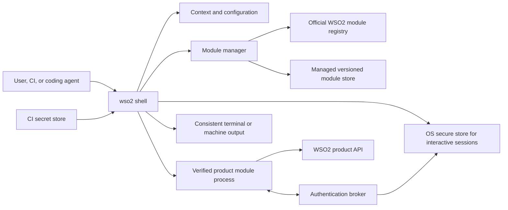
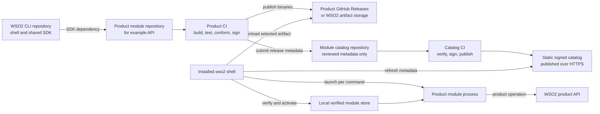

# WSO2 CLI — Architecture

**Status:** Working draft  
**Date:** 2026-07-24  
**Related:** [Product requirements](product-requirements.md),
[first CLI vertical slice](plans/first-cli-vertical-slice.md)

## 1. Design summary

The `wso2` CLI will be a Go shell with a managed module runtime. Each product
module is an independently versioned native executable owned by a WSO2 product
team. The shell resolves modules from a CLI-managed local versioned store and
launches them out of process.

This is an **SDK-first hybrid architecture**:

- execution stays out of process, preserving independent releases and avoiding
  Go plugin ABI coupling;
- every production module implements a mandatory control contract;
- a shared Go SDK hides the process protocol and supplies common authentication,
  context, help, output, and error behavior;
- existing CLIs may use a temporary migration adapter, but raw passthrough is
  not considered fully conformant.

The architecture deliberately does not copy kubectl's arbitrary `PATH`
discovery. It adopts Krew's useful versioned-store and receipt ideas while
adding publisher verification, compatibility, provenance, rollback protection,
and a first-class offline model.

## 2. Architectural principles

1. **The shell owns policy; products own workflows.**
2. **One top-level product namespace maps to one official module.**
3. **Common behavior is implemented once in the SDK and platform services.**
4. **Modules release independently of the shell.**
5. **Installed state is explicit, receipt-backed, and reproducible.**
6. **The active installation changes only after complete verification.**
7. **Long-lived credentials never enter module storage.**
8. **Native process isolation is not represented as a security sandbox.**
9. **Automation never depends on terminal formatting or implicit network
   access.**

## 3. System context



## 4. Major components

### 4.1 Root shell

The root shell owns:

- root commands and reserved namespace precedence;
- root argument parsing and product-namespace dispatch;
- context selection and configuration;
- authentication and secure credential storage;
- module discovery and lifecycle entry points;
- root help, version, diagnostics, and completion;
- invocation policy such as interactivity and network allowance.

The root must remain small enough that product command changes do not require a
root release.

### 4.2 Module manager

The module manager is a deep subsystem behind a narrow interface:

```text
Resolve(namespace, constraint, platform) -> Release
Install(release, policy) -> Receipt
Activate(name, version) -> ActiveInstallation
Verify(name, version) -> VerificationReport
Rollback(name) -> ActiveInstallation
Remove(name, version) -> Result
```

It owns catalog metadata, dependency-free release resolution, downloading,
verification, safe extraction, receipts, activation, retention, and rollback.
It does not parse product commands or store product credentials.

### 4.3 Module registry

The official registry maps an assigned product namespace to signed release
metadata. It contains metadata, not mutable executable state.

The registry must support:

- authorized publisher delegation by namespace;
- platform-specific artifacts;
- semantic module versions and release channels;
- host and module-protocol compatibility;
- digests, signatures, provenance, and SBOM references;
- release revocation;
- expiring and rollback-protected catalog metadata;
- mirrors and signed offline export.

### 4.4 Product module process

A product module:

- owns one top-level product namespace;
- implements product resources, actions, validation, and API calls;
- uses the shared SDK for the mandatory contract and common behavior;
- is distributed as a signed platform-specific executable/archive;
- can be updated without rebuilding the root shell.

Product modules are trusted WSO2 software. Running them in another process
isolates failures and release cycles, but does not remove their access to
resources available to the user account.

### 4.5 Shared Go SDK

The SDK is the author-facing interface. Module authors should not need to know
the wire protocol.

Conceptual usage:

```go
func main() {
    sdk.Run(sdk.Module{
        Name:     "api",
        Version:  build.Version,
        Commands: NewCommands,
    })
}
```

The SDK provides:

- protocol handshake and module identity;
- standard Cobra construction and help templates;
- common flags such as `--context`, `--output`, `--no-input`, `--quiet`, and
  `--verbose`;
- access to selected context and invocation policy;
- authentication-broker client;
- typed result and problem definitions with authoring helpers;
- automatic secret redaction;
- command-schema description and completion metadata;
- health and conformance hooks;
- test fixtures and golden-output helpers.

The shell owns final table, JSON, and YAML rendering plus problem-to-exit-code
mapping. The public SDK API should remain substantially smaller than its
implementation.

### 4.6 Authentication broker

The root process owns authentication policy and long-lived interactive state.
A module communicates with an invocation-scoped broker through the module
contract on its inherited standard input and standard output streams.

The broker:

- identifies the already verified module through the launch handshake;
- checks the module's declared audience and scope capabilities;
- resolves the selected context, its identity, and the relevant product
  session;
- refreshes credentials without exposing refresh tokens;
- returns short-lived or invocation-scoped access material and restricts
  audience and scope when the deployment supports them;
- refuses rather than silently issuing broader or incorrectly targeted access
  when a requested narrowing is unavailable;
- redacts secrets and records security-relevant diagnostics without recording
  the secret value.

The IPC endpoint must not be a world-discoverable local port.

#### Identity

An **identity** is one reusable login session, together with every product for
which the broker can derive valid access from that session without another
login or an independently supplied credential.

An identity is not an issuer. Two products configured against the same issuer
URL do not share an identity unless that session can actually produce access
each of them accepts. A product that validates only its own resident issuer, or
that requires its own separately authenticated OAuth client, personal access
token, or password, belongs to a different identity and therefore to a
different context.

Whether a session can derive access for a product is a property of the running
deployment, not of a configuration file. The configuration records the
operator's assertion. A wrong assertion surfaces as a typed authentication or
authorization failure when a command needs access, never as a malformed
document.

The broker derives product-specific access bound to the product's
audience/resource and to scopes. One identity therefore does not mean one
access token: a separate short-lived token may be derived for each product
invocation. How narrowly that derivation can be bound is a per-backend
capability, so the broker resolves a downscoping strategy per deployment and
exposes what it can enforce instead of degrading silently.

Product-specific legacy authentication that cannot yield derived, short-lived
access — a management password grant, or a long-lived token the shell can only
pass through unchanged — remains compatibility-adapter territory. A module
reached that way does not carry the same trust property, and the design states
that rather than presenting it as equivalent.

#### Interactive login modes

> **What ships today.** This section describes the target architecture. The
> shell implements browser Authorization Code with PKCE, the Device
> Authorization Grant, and inline client credentials. Personal access tokens
> validate as legal configuration and refuse at use with the stable code
> `auth.kind_not_implemented` — accepted so that a document written for them
> stays readable, not executed. See
> [the login first slice](plans/login-first-slice.md).
>
> The device grant is reached through the `oauth-device` **kind**, not yet
> through a login-time flag: `wso2 login --device-code` is not in this release.
> So the mode-not-kind rule below states the target, and today an identity that
> can only be established by device says so in its kind.

Browser Authorization Code with PKCE and the Device Authorization Grant are two
**login modes for the same interactive OIDC identity**, not two stored
authentication methods. An identity records that it authenticates interactively
against an issuer; the mode is chosen at login time, by the machine the user is
sitting at.

`wso2 login` uses the OAuth 2.0/OIDC Authorization Code flow with PKCE, opening
a browser for the user to authenticate and approve the request. This is the
default interactive login.

`wso2 login --device-code` uses the Device Authorization Grant for a developer
on a headless or remote machine. The CLI displays the verification instructions
and the user approves the request in a browser on another device.

Device authorization is available only where the backend advertises it, through
the discovery document's `device_authorization_endpoint` or the corresponding
grant type. Where the advertisement is absent, the broker refuses with a stable
error rather than falling back to a browser the user cannot open.

The shell completes either exchange and stores any resulting long-lived
interactive credential, such as a refresh token, in the OS secure store. Device
authorization is still interactive and must not be used by CI.

#### On-premises login

An on-premises context explicitly configures its identity: the products it
reaches, their endpoints, and the authentication method. The shell uses only
mechanisms that deployment supports.

The CLI must not infer that an on-premises endpoint supports WSO2 Cloud SSO,
WSO2 Identity Server, shared authentication, or device authorization. Products
that one login cannot reach belong to separate identities, and therefore to
separate contexts. A single identity never mixes authentication methods across
its products.

#### CI authentication

CI is always non-interactive. It authenticates with:

- client credentials, which are the preferred CI method;
- a personal access token, where the product issues one;
- a future workload-identity mechanism.

Browser Authorization Code and Device Authorization flows are invalid in CI
or any invocation using non-interactive mode. The CLI must fail with a stable
configuration error instead of waiting for user approval.

A non-interactive method establishes no reusable session, so there is nothing
for a separate login step to persist. The shell acquires access inline during
the invoking command, and CI does not require a preceding `wso2 login`.

With client credentials the shell holds the client secret, performs the token
exchange itself, and passes the module only the resulting short-lived access
token; the secret never leaves the shell. A personal access token that a
product accepts directly as bearer material cannot be narrowed or derived from,
so it is compatibility-adapter territory under the identity rules above rather
than an equivalent CI method.

The CI platform injects the secret from its secret store. The shell reads it
from the configured variable name or stdin, keeps it only in job-process
memory, and does not write it to the filesystem, OS secure store, context
configuration, or module environment.

### 4.7 Context and configuration store

The configuration store contains non-secret data:

- named identities, as defined in §4.6;
- named cloud and on-premises contexts;
- default context, and any per-namespace context bindings;
- module pins and update policy;
- mirror/offline policy;
- output and interaction defaults.

#### Identities and contexts

**Each context references exactly one identity. One identity may back several
contexts.** Several projects or organizations reached through the same login
are several contexts over one identity, not several logins.

Configuration divides along that boundary:

- an **identity** carries the authentication kind, the issuer, the client
  identifier, and an opaque OS-secure-store reference or CI variable name;
- a **product entry** on an identity carries the endpoint plus the
  audience/resource metadata the broker needs to target access;
- a **context** carries targeting only — organization, project — and the name
  of its identity.

A context therefore never mixes authentication methods across products. Where
an identity's authentication cannot reach a product, that product belongs to
another identity and another context.

Where authentication itself needs a tenant — a home organization at the issuer
— that belongs to the identity's authentication configuration and is named
distinctly from the context's target organization, which the broker may reach
through an organization-switch exchange on the same session.

The legal authentication kinds are `oauth-browser`, `oauth-device`,
`client-credentials`, and `pat`. Availability is per deployment, not universal:
`oauth-device` is valid only where the backend advertises the grant, and `pat`
only for products that accept product-issued long-lived tokens. Evidence for
this set is recorded in
[the authentication landscape research](research/wso2-authentication-landscape.md)
and [product authentication compatibility](research/product-authentication-compatibility.md).

#### Selection

A command resolves its context in this order:

1. the `--context` flag;
2. the `WSO2_CONTEXT` environment variable;
3. a context bound to the invoked product namespace, if one is recorded;
4. the configured default context;
5. none, which produces a typed refusal when a command requires access.

Step 3 is a recorded decision, not an inference: a per-namespace binding exists
only because a command wrote it, and it is reported by context listings like
any other selection. Without it, a deployment whose products require separate
logins would force `--context` onto nearly every invocation.

Selecting a context never authenticates. `wso2 context use` writes the
selection and performs no network call. A selected but unauthenticated context
produces an authentication-class problem at first use.

Login may create the context it authenticates, so that a first-run user is not
required to write configuration by hand. Creation is explicit about the name it
assigns and is reported; it never silently replaces an existing context.

#### Credentials

The store never contains access tokens, refresh tokens, personal access tokens,
client secrets, passwords, or private keys. Importing or exporting an identity
or context therefore moves target and authentication configuration but never a
credential.

Interactive long-lived credentials are stored in the OS keychain or another
approved secure store and referenced by opaque identifiers. CI credentials
remain owned by the CI secret store and exist in the CLI only in job memory.

#### Writing grants nothing

The architecture proof holds the invariant that no shell command can write a
context, so no shell command can grant itself access. A production
`wso2 context create` ends that invariant, and replaces it with one that
survives a writable store: **writing a context or an identity grants nothing.**

It holds through five properties, each of which is testable:

1. the types have nowhere to put a credential, and a value supplied where a
   reference or variable name belongs is rejected rather than stored;
2. a created identity and context, with no login, yield an
   authentication-class refusal on first use;
3. an imported identity and context grant the importer nothing they did not
   already hold in their own OS secure store;
4. a secure-store reference is a lookup key, not a capability: naming an entry
   the invoking OS user cannot read fails as an authentication problem;
5. export is credential-free by construction, because the document has no
   credential to remove.

#### Schema evolution

The document carries a schema version. Unknown members are tolerated on read,
so a newer shell may record non-secret facts an older one ignores, and a single
unsupported authentication kind never renders a whole document unreadable.

Unknown members are **not** preserved on write. Until a preservation mechanism
exists, an older shell that rewrites a newer document drops what it did not
understand, which matters as soon as commands can write configuration. A new
*required* field is a schema revision, not an addition within a version.

Concrete, non-secret examples are maintained in
[Authentication context examples](examples/authentication-contexts.md), which
illustrates the decisions recorded here and does not extend them.

### 4.8 Output and problem model

Product handlers return typed values. The SDK owns their presentation:

```text
Result
  data
  table columns
  warnings
  pagination metadata

Problem
  stable code
  category
  human message
  safe details
  recovery suggestion
  exit class
```

JSON and YAML output must preserve the same semantic fields. Table output may
select a readable subset but must not change the operation's meaning. Diagnostic
logs go to standard error; machine output goes to standard output.

## 5. Module contract

Every production module implements one protocol version through the SDK: the
version of the SDK release it was built against. The shell supports a window of
two, so a module built against either negotiates successfully. See
[section 10](#10-version-model).

The shell and a module exchange length-delimited Protobuf messages over the
module process's inherited standard input and standard output. Module standard
output is protocol-only, module standard error is reserved for bounded
diagnostics, and only the shell writes user-facing standard output. See
[ADR 0002](adr/0002-module-transport.md) and
[ADR 0003](adr/0003-shell-owned-output.md).

### 5.1 Identity

The module reports:

- namespace;
- module version;
- protocol versions supported;
- build identity;
- declared capabilities.

The root checks this identity against the signed manifest and receipt before
the product operation proceeds.

### 5.2 Description

The module exposes command metadata generated from its actual command tree.
Authors must not maintain a separate handwritten help schema.

The description includes:

- commands and aliases;
- arguments and flags;
- short and long descriptions;
- examples;
- output shapes where declared;
- interactivity and authentication requirements.

### 5.3 Health

The module provides a non-mutating startup health check used during installation
and diagnostics. It validates that the artifact can start, negotiate the
protocol, and construct its command tree. It must not require a live product
endpoint.

### 5.4 Invocation

For normal execution:

1. the root parses built-in flags and identifies the product namespace;
2. it resolves and verifies the active module;
3. it selects the invocation context and creates an invocation-scoped broker
   session;
4. it launches the module with sanitized environment and original product
   arguments;
5. the SDK completes the identity/protocol handshake;
6. the module runs its product command and requests authentication if required;
7. the module returns a typed result or problem;
8. the shell renders output or diagnostics and exits with the centrally
   defined exit class.

This retains normal CLI-process execution rather than converting every product
operation into a generic JSON-RPC method.

## 6. Release manifest

A signed release contains enough information to resolve and verify a module
without executing it. A conceptual manifest is:

```yaml
apiVersion: cli.wso2.com/v1
kind: ModuleRelease
metadata:
  name: api
  version: 0.9.0
  publisher: api-platform-team
spec:
  namespace: api
  channel: stable
  compatibility:
    host: ">=0.4.0 <2.0.0"
    protocol: "1"
  capabilities:
    authAudiences:
      - api-platform
  artifacts:
    darwin-arm64:
      url: https://downloads.example.invalid/api/0.9.0/module.tar.gz
      size: 12345678
      sha256: "4f3c...9a2e"
      signature: https://downloads.example.invalid/api/0.9.0/module.sig
      provenance: https://downloads.example.invalid/api/0.9.0/provenance.intoto.jsonl
      sbom: https://downloads.example.invalid/api/0.9.0/sbom.spdx.json
```

The final schema should use canonical serialization and signed metadata rather
than embedding signing details in an ambiguous ad hoc format.

### 6.1 Module publishing and consumption flow

The shell, product modules, and catalog have independent repositories and
release lifecycles:

- the `wso2` repository builds and releases the root shell and shared module
  SDK;
- each product team owns a separate module repository and builds its module
  with the shared SDK;
- product CI publishes signed, platform-specific module artifacts to that
  product's GitHub Releases or approved WSO2 artifact storage;
- a separate catalog repository contains reviewed release metadata, not module
  binaries;
- catalog CI signs and publishes static catalog metadata over HTTPS;
- the shell consumes the published catalog, downloads an artifact from its
  product-owned release location, and verifies it before activation.

The catalog entry is the authoritative link between an assigned namespace and
an official product release. It records the module version, shell and protocol
compatibility, platform-specific artifact URLs and digests, publisher
authority, signatures, provenance, revocation state, and release channel. The
shell selects the newest compatible verified release allowed by the user's
channel and pinning policy; it does not assume that the numerically newest
release is usable.



Publishing a module and deploying a product workload are separate operations.
The flow above publishes a CLI module for installation by the shell. Commands
such as `wso2 integration component deploy` remain product operations
implemented by the corresponding module after it has been installed.

For a user invocation such as `wso2 api gateway list`:

1. The shell resolves `api` from its local active receipt.
2. If the module is missing, an interactive invocation may offer to install the
   official module. Non-interactive execution never installs implicitly unless
   policy explicitly permits it.
3. Installation or update refreshes the signed catalog, selects a compatible
   release, downloads its artifact, and follows the verification and activation
   procedure in section 7.
4. Normal commands use the installed local module and do not require a catalog
   request on every invocation.
5. The shell launches the verified module, negotiates the protocol, supplies
   non-secret context, and brokers invocation-scoped authentication as
   described in sections 4.6 and 5.4.

Product and catalog release pipelines are decoupled from shell releases. A
product team can publish a compatible module without rebuilding the root
binary, and moving artifact or catalog hosting does not change the module
protocol. Signing private keys never live in source repositories; protected CI
or an approved key-management service provides signing operations.

## 7. Installation and activation

### 7.1 Online installation

1. Load and verify fresh-enough signed catalog metadata.
2. Resolve exact namespace, version/channel, host, protocol, OS, and
   architecture.
3. Confirm that the publisher is authorized for the namespace.
4. Download the artifact into a private quarantine directory.
5. Verify expected size, digest, artifact signature, provenance, and revocation
   status.
6. Safely extract it, rejecting absolute paths, traversal, links escaping the
   destination, unexpected files, and unsafe permissions.
7. Verify module identity and run the non-mutating health check.
8. Write an immutable receipt containing the signed release metadata and
   verification result.
9. Atomically update the active-version state.
10. Retain the previous verified version according to the rollback policy.

Any failure before activation leaves the old active version unchanged.

### 7.2 Update

An update performs the same verification path as installation. A module version
is immutable; publishing changed bytes requires a new version. CI can pin exact
versions and disable implicit metadata refresh or installation.

#### 7.2.1 Update discovery and notification

The shell uses the signed catalog to distinguish the installed version from
newer available releases. Update discovery follows these rules:

1. Explicit lifecycle commands such as `wso2 module list`,
   `wso2 module update <name>`, and `wso2 module update --all` may refresh
   catalog metadata when network policy allows it.
2. Interactive use may perform a background catalog refresh no more than once
   per configurable interval, initially 24 hours. Fresh verified metadata is
   cached locally, and a failed refresh does not delay or fail the product
   command.
3. The shell filters catalog releases by channel, pinning policy, host version,
   protocol version, operating system, architecture, revocation, and publisher
   trust before reporting an update. "Available" therefore means the newest
   compatible verified release, not merely the highest version number.
4. After a successful interactive command, the shell may write a concise update
   notice to standard error. It never writes update notices into standard
   output used for table, JSON, or YAML results.
5. Non-interactive, offline, or explicitly network-disabled execution performs
   no implicit catalog refresh and emits no update notice based on stale or
   unavailable network metadata. CI uses pinned, pre-installed modules unless
   an explicit lifecycle command permits network access.
6. Updating remains explicit by default. Any future automatic-update mode is
   opt-in and uses the same staged verification, atomic activation, and
   rollback behavior as an explicit update.

If a newer release requires a newer shell or protocol, the notice identifies
that dependency and keeps the current compatible verified module active. If an
update download, verification, health check, or activation fails, the current
active version remains unchanged.

Revocation is not an ordinary update notification. When fresh verified metadata
marks the active release as revoked, the shell records a security diagnostic
and blocks that module according to policy, with guidance to install a safe
compatible version. Offline policy must define how long cached revocation
metadata remains acceptable; it must not silently represent stale metadata as
current.

### 7.3 Verification

Verification checks:

- the receipt's signed release metadata and local verification evidence;
- release revocation;
- host/protocol compatibility;
- executable digest and secure file ownership/permissions;
- identity and health handshake.

The active executable's integrity is checked before launch. Performance
optimizations must not turn file timestamps alone into the trust decision.

### 7.4 Rollback

Rollback changes the active pointer to a retained installation only after
rechecking integrity, compatibility, and revocation. A revoked release is not a
valid rollback target.

### 7.5 Offline installation

Offline mode never means unsigned mode. Every offline path follows the same
identity, compatibility, verification, activation, receipt, rollback, and
revocation-metadata policy as online installation.

An individual `.wso2module` file packages one module's signed release metadata,
artifact, provenance, and required trust metadata. It is imported by an
existing shell with `wso2 module install --file <module.wso2module>`.

A fresh machine uses a platform-specific, self-installing offline bundle. The
bundle contains a signed bootstrap installer, an exact root-shell release, the
selected compatible modules, a signed catalog snapshot, a bundle manifest,
digests, signatures, provenance, and the trust material required for offline
verification. The target does not need a preinstalled `wso2` command. After the
package is transferred through an approved process, Windows and macOS verify
the installer through their platform trust mechanisms before execution. A
Linux bundle is distributed with a detached signature and verification
instructions. Its bootstrap signature must be verified with an independently
trusted WSO2 public key before execution. The bootstrap then makes no network
requests; it verifies the remaining package contents, installs the shell, and
verifies and activates the included modules.

On a connected machine, `wso2 bundle create` can build a tailored,
platform-specific self-installing bundle from verified catalog releases. It
must not package arbitrary local executables. If the air-gapped target already
has the shell, `wso2 bundle inspect <file>` can report the contents and
verification state without installation, and `wso2 bundle install <file>` can
import the bundle to add or update modules. These commands are not prerequisites
for fresh-machine installation.

## 8. Storage layout

Conceptual user-level state:

```text
~/.wso2/
  config.yaml
  cli/
    trust/
    catalog/
    modules/
      api/
        versions/
          0.9.0/
            module
            receipt.json
        active.json
```

`active.json` is updated atomically and names an exact installed version and
receipt digest. A state file is preferred over relying only on symlink behavior
because the CLI must behave consistently on Windows.

Sensitive credentials do not appear in this tree.

## 9. Security model

### 9.1 Threats in scope

- compromised download storage;
- compromised or stale catalog metadata;
- unauthorized product-team publication;
- downgrade, freeze, and mix-and-match attacks;
- archive traversal and unsafe extraction;
- local modification or `PATH` shadowing;
- credential leakage through arguments, environment, output, or logs;
- a compromised product build pipeline;
- revoked signing authority or release.

### 9.2 Publishing trust

The design uses a TUF-style metadata hierarchy:

- embedded and rotatable WSO2 trust roots;
- threshold-controlled root authority;
- delegated namespace publishing authority;
- expiring timestamp and snapshot metadata;
- monotonic metadata versions preventing rollback;
- emergency key and release revocation.

Product CI signs the artifact and supplies verifiable build provenance and an
SBOM. Registry admission verifies ownership, policy, conformance, scans, and
provenance before publishing signed release metadata.

### 9.3 Runtime trust boundary

A verified native module still runs with the user's operating-system
permissions. The v1 trust decision is therefore: only authorized WSO2 product
software may run through the managed module path.

The host can enforce access to host-owned facilities such as the authentication
broker. Capability declarations alone cannot prevent a native executable from
reading user-accessible files or opening a network connection. OS sandboxing is
future defense in depth, not a claimed v1 property.

### 9.4 Secret handling

- Interactive refresh tokens and long-lived credentials remain in the OS
  secure store.
- CI secrets are read from the CI secret source, remain only in job memory, and
  are never persisted by the CLI.
- Context configuration stores authentication methods and secret references or
  variable names, never secret values.
- Modules receive short-lived or invocation-scoped access material; audience
  and scope are narrowed whenever supported.
- Secret values are never placed in command arguments, receipts, context files,
  logs, or module environments.
- SDK secret types are redacted by default.
- Debug and error paths are tested with injected canary secrets.
- Authentication failures identify the missing context/session without
  including tokens or private request data.

## 10. Version model

The runtime has three independent versions:

- **Host version:** release of the `wso2` binary.
- **Protocol version:** compatibility contract between shell and modules.
- **Module version:** product module release owned by its product team.

The shell supports a protocol window of the current version and its
predecessor, so a user whose shell is one protocol generation behind is not cut
off from module releases: there is a full generation in which to update the
shell before a module release can outrun it. The window is declared once, in
the SDK's protocol package, and both the shell and the release gate that
refuses a module the released shell cannot launch read that one declaration.

The launch gate is the protocol window intersected with the platform, and
nothing else. **The shell never compares a module's version against its own**,
in either direction. A product module carries its product's version scheme,
chosen so its users recognise it, and that scheme does not track the shell's,
so a module numbered far above or far below the shell says nothing about
whether the two can speak. Comparing them would refuse modules that run
perfectly, and in terms a user cannot act on. Reintroducing the comparison
would look like defensive tightening; it is not, and there is no version pair
for which it is correct.

Proposed output:

```text
$ wso2 version
WSO2 CLI       v0.1.0
Protocol       v2, v1
Commit         abc123
Platform       darwin/arm64

$ wso2 module list
NAME       INSTALLED  AVAILABLE  COMPATIBLE  VERIFICATION
api        v0.8.1     v0.9.0     yes         verified
identity   v1.4.0     v1.4.0     yes         verified
```

Installed versions come from receipts. Available versions come from the local
verified catalog and may be stale until the user requests a refresh.

## 11. Repository and release structure

The initial implementation uses a small multi-module monorepo with two public
deliverables: the user-facing CLI and the Go SDK used by product teams.

```text
.
├── go.mod
├── cmd/wso2/main.go
├── internal/
│   └── {auth,catalog,config,context,modules,rpc,updater,bundle}/
└── sdk/
    ├── go.mod
    ├── protocol/
    ├── examples/
    └── testkit/
```

The root Go module builds the `wso2` CLI. `cmd/wso2/main.go` is its entry point,
while shell implementation belongs in root `internal/` packages for concerns
such as authentication, the module catalog, configuration, contexts, module
management, RPC, updates, and offline bundles.

The top-level `sdk/` directory is a separate public Go module. It contains the
command and module interfaces, authentication and context contracts, tests,
examples and test utilities, and the versioned `sdk/protocol` package. Product
repositories depend only on this public SDK and must never import the shell's
`internal/` packages.

There is no separate top-level `api/` directory in the first version. The
complete versioned subprocess and RPC contract lives in `sdk/protocol`, which
is imported by both shell-internal RPC code and product modules. If
multi-language support or schema generation becomes necessary, canonical
schemas may move to a top-level `api/` directory and generated Go bindings may
return to the SDK, provided wire compatibility is preserved.

The CLI and SDK are independently versioned. CLI releases use normal repository
tags such as `v1.2.0` and publish platform binaries or installers for users. SDK
releases use submodule-prefixed tags such as `sdk/v1.1.0` and publish the
top-level `sdk/` directory as a tagged public Go module from GitHub for product
teams; users do not install the SDK.

Detailed build, test, and release procedures belong in a future contributor
document rather than this architecture design.

## 12. Existing CLI migration

Migration proceeds in increasing levels of conformance:

1. Package the existing CLI as a signed managed executable.
2. Add the SDK identity, description, health, and invocation bootstrap.
3. Replace independent credential handling with the authentication broker.
4. Replace custom output and errors with typed SDK results and problems.
5. Adopt common help, flags, exit codes, and secret redaction.
6. Pass the complete cross-platform conformance suite.

The compatibility adapter exists to reduce migration risk, not as a permanent
alternative contract. A module is presented as fully verified only when both
its supply chain and runtime conformance pass.

The pilot should include:

- one clean factory-injected Cobra CLI, such as Agent Manager's `amctl`;
- one CLI with global initialization or legacy coupling, such as `apictl` or
  `mi`.

This validates both the ideal authoring model and the difficult migration path.

## 13. Testing strategy

This section defines the system-wide testing strategy. The ordered test gates
for the first architecture proof are maintained in the
[first CLI vertical-slice plan](plans/first-cli-vertical-slice.md).

### Unit tests

- manifest and compatibility resolution;
- trust and revocation decisions;
- safe archive extraction;
- receipt and atomic-state operations;
- context selection;
- output and problem serialization;
- secret redaction.

### Contract tests

Every module is tested against the same black-box suite:

- identity and protocol negotiation;
- help and command-schema generation;
- standard flags;
- table/JSON/YAML equivalence;
- exit codes and typed errors;
- authentication-broker behavior;
- non-interactive behavior;
- canary-secret non-disclosure.

### Integration tests

- fresh install, update, failure before activation, rollback, remove;
- offline bundle and mirror installation;
- expired, rolled-back, revoked, or tampered metadata;
- corrupted and malicious archives;
- incompatible host and protocol versions;
- cloud Authorization Code with PKCE as the default interactive login;
- Device Authorization as the explicit headless login mode, and its refusal
  with a stable error where the backend does not advertise the grant;
- rejection of browser and device authorization in CI/non-interactive mode;
- on-premises identities without assuming WSO2 Cloud SSO or Identity Server;
- one identity backing several contexts: a single login serving every context
  that references it, with no further authentication on switch;
- per-product access derived from one session and bound to each product's
  audience and scopes, rather than one token reused across products;
- refusal, rather than a broader grant, where a requested narrowing is
  unavailable;
- a product the selected context's identity cannot reach failing with guidance
  that names the contexts that can;
- recorded namespace bindings selecting a context, and no selection occurring
  without an explicit flag, variable, binding, or default;
- context switching performing no network call and no login;
- the five writing-grants-nothing properties of §4.7, including a created and
  an imported context yielding an authentication-class refusal without a login;
- client credentials completing inline with no separate login step, and the
  client secret never reaching a module;
- OS secure-store integration for interactive credentials;
- CI secret-variable and stdin inputs with no filesystem or secure-store
  persistence;
- identity and context import/export proving that no credential values are
  present.

### End-to-end tests

Run pilot product operations on every supported OS/architecture and validate
human and machine output. CI must also prove that pinned, pre-installed modules
work with network access disabled.

## 14. Operational behavior and recovery

- Catalog failure does not break already installed, non-revoked modules when
  policy permits local operation.
- Failed installation or update never changes the active version.
- Missing authentication returns a stable auth problem and the exact login
  command appropriate to the selected context.
- A non-interactive invocation configured with browser or device authorization
  fails immediately and identifies the accepted CI authentication methods.
- Incompatible modules are not launched; the error reports compatible
  alternatives from verified local metadata.
- `wso2 doctor` reports context, secure-store, catalog, receipt, module
  integrity, compatibility, and protocol status without printing secrets.

## 15. Decisions and remaining design work

The architecture, SDK-first hybrid model, official-only trust scope, and
security principles are selected.

The next design session should settle, in order:

1. exact module lifecycle command semantics;
2. release manifest and registry ownership;
3. remaining module message semantics and the SDK public API;
4. context/auth broker API;
5. output/problem schema and exit-code table;
6. namespace and pilot-module selection;
7. rollout and standalone-CLI compatibility policy.

The approved architecture proof has its own bounded
[implementation plan](plans/first-cli-vertical-slice.md). Later delivery work
requires a separate reviewed plan. Phase lists in research documents remain
recommendations, not implementation authority.

## 16. Research

- [Archived original proposal](research/archive/original-proposal.md)
- [Public WSO2 CLI inventory](research/public-wso2-cli-inventory.md)
- [kubectl and Krew findings](research/kubectl-krew.md)
- [Azure CLI, AWS CLI, and Google Cloud CLI comparison](research/cloud-cli-comparison.md)
- [Module architecture options](research/module-architecture-options.md)
- [Root CLI installation and distribution](research/root-cli-installation-distribution.md)

## 17. Implementation plan

- [First CLI vertical-slice plan](plans/first-cli-vertical-slice.md)
