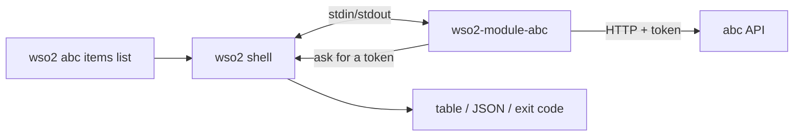
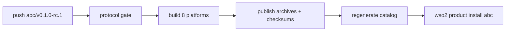

# Building a product module

**Status:** Working draft  
**Related:** [Architecture](../architecture.md),
[module manifest](../reference/module-manifest.md),
[module SDK](../reference/module-sdk.md),
[module catalog](../reference/module-catalog.md),
[release artifacts](../reference/release-artifacts.md),
[troubleshooting](troubleshooting-modules.md),
[contributing](../../CONTRIBUTING.md)  
**Last reviewed:** 2026-09-16

This guide walks you through building a product module, using a module called
`abc` as the example. When you finish, `wso2 abc greet` and `wso2 abc items list`
both work.

The finished example is in [`modules/abc`](../../modules/abc/). For a module that
calls a real service, see [`modules/reference`](../../modules/reference/).

## How it works

A product module is a separate program. The `wso2` shell starts it and talks to it
over stdin/stdout.



| Your module does | The shell does |
| --- | --- |
| Defines commands and flags | Login, credentials, tokens |
| Validates input | Picking the context |
| Calls your product API | Printing tables and JSON |
| Returns results or typed errors | Exit codes, `--help`, installs and updates |

**Three rules:**

1. Import only `github.com/wso2/wso2-cli/sdk/...`. Never import `internal/...`.
2. **Never print to stdout.** Stdout carries the protocol, so a stray
   `fmt.Println` breaks the module. Return a result instead. Write debug
   output to stderr.
3. Never parse, log, print, or save the access token.

## 1. Generate the module

```console
$ make new-module NAMESPACE=abc
Created the abc module in modules/abc:
  modules/abc/go.mod
  modules/abc/module.json
  modules/abc/README.md
  modules/abc/cmd/wso2-module-abc/main.go
  modules/abc/cmd/wso2-module-abc/main_test.go
  modules/abc/cmd/wso2-module-abc/namespace_test.go

$ make test-module NAMESPACE=abc
ok  	github.com/wso2/wso2-cli/modules/abc/cmd/wso2-module-abc
```

Always use the generator. Don't create these files by hand, because the
generator fills in the correct SDK version and protocol version from your
checkout.

**Pick the namespace carefully.** It becomes the command users type
(`wso2 abc`), the tag prefix (`abc/v1.0.0`), and the program name
(`wso2-module-abc`). Changing it later means a migration.

The generator refuses these namespaces:

- shell commands such as `login`, `context`, and `version`. The shell handles
  them before any module runs, so your module would never be called.
- namespaces that another module already uses
- `reference`
- anything other than lowercase letters and digits that starts with a letter

### Generated files

```text
modules/abc/
├── go.mod              # SDK dependency. No replace directives.
├── module.json         # namespace, compatibility, permissions
├── README.md
└── cmd/wso2-module-abc/
    ├── main.go         # commands and handlers
    ├── main_test.go
    └── namespace_test.go
```

`module.json`:

```json
{
  "schemaVersion": 1,
  "namespace": "abc",
  "title": "Abc",
  "compatibility": {
    "shell": ">=0.1.0 <2.0.0",
    "protocolVersions": [2]
  },
  "capabilities": {
    "authAudiences": [],
    "authScopes": []
  }
}
```

- `protocolVersions` comes from the SDK. Don't edit it by hand.
- `capabilities` lists every audience and scope the module is allowed to
  request. Start with empty lists and add entries when you need them
  (see [step 3](#3-call-a-protected-api)).

The [module manifest reference](../reference/module-manifest.md) documents
every field.

## 2. Add a command

Commands are ordinary [Cobra](https://github.com/spf13/cobra) commands. The
only difference is that a handler **returns** its output instead of printing it.

`modules/abc/cmd/wso2-module-abc/greet.go`:

```go
func addGreet(root *cobra.Command, tree *cobratree.Tree) {
	var name string
	cmd := &cobra.Command{Use: "greet", Short: "Say hello."}
	cmd.Flags().StringVar(&name, "name", "", "Who to greet.")
	root.AddCommand(cmd)

	tree.Handle(cmd, func(ctx context.Context, request module.Request) (result.Result, error) {
		if strings.TrimSpace(name) == "" {
			return result.Result{}, problem.New(problem.CategoryUsage, "abc.name_required", "--name is required").
				WithRecovery("Run wso2 abc greet --name <name>.")
		}
		return result.New("abc.greet/v1").
			With("message", "Message", "Hello, "+name+"!").
			With(NextField, "Next", "Run wso2 abc status."), nil
	})
}
```

Register the command in `commands()` in `main.go`:

```go
func commands() *cobratree.Tree {
	root := &cobra.Command{Use: Namespace, Short: "Abc commands for the WSO2 CLI."}
	statusCommand := &cobra.Command{Use: "status", Short: "..."}
	root.AddCommand(statusCommand)

	tree := cobratree.New(root).Handle(statusCommand, status)
	addGreet(root, tree)
	return tree
}
```

The shell renders the result like this:

```console
$ wso2 abc greet --name Ada
MESSAGE
Hello, Ada!

Next  Run `wso2 abc status`.

$ wso2 abc greet --name Ada -o json
{
  "message": "Hello, Ada!",
  "next": "Run wso2 abc status."
}

$ wso2 abc greet
error: --name is required (abc.name_required)
  Run `wso2 abc greet --name <name>`.
$ echo $?
64
```

A few details:

- **Results:** `result.New("<namespace>.<thing>/v1")` names the result's
  shape. The shell displays fields in the order you add them with `.With(...)`.
  Every result needs at least one field.
- **Tables:** use `.WithColumn(...)` and `.WithRow(...)`, as in step 3.
- **Errors:** `problem.New(category, code, message)`. The category determines
  the exit code: `CategoryUsage` exits with 64. Use `CategoryProductService`
  when your API fails.
- **Flags:** the SDK parses flags before your handler runs. If a flag is
  invalid, the user gets a clean usage error.
- **Help:** `wso2 abc --help` works automatically because `Serve` sends the
  whole command tree to the shell.
- **Unbound commands:** a command that has no handler is reported as unknown.

## 3. Call a protected API

The handler asks the shell for a short-lived token, then calls the API with it.

`modules/abc/cmd/wso2-module-abc/items.go`:

```go
const (
	ItemsAudience = "abc-api"
	ItemsScope    = "abc:items:read"
)

func listItems(ctx context.Context, request module.Request) (result.Result, error) {
	if request.Context.Endpoint == "" {
		return result.Result{}, problem.New(problem.CategoryUsage, "abc.no_endpoint", "no abc endpoint is configured").
			WithRecovery("Set products.abc.endpoint in your context.")
	}

	access, err := request.Access.Acquire(ctx, module.AccessRequest{
		Audience: ItemsAudience,
		Scopes:   []string{ItemsScope},
	})
	if err != nil {
		return result.Result{}, err // shell denied it: return unchanged
	}

	req, _ := http.NewRequestWithContext(ctx, http.MethodGet, request.Context.Endpoint+"/items", nil)
	req.Header.Set("Authorization", "Bearer "+access.Token)
	// ... send the request and decode []item ...

	out := result.New("abc.items/v1").
		With("count", "Items", fmt.Sprint(len(body))).
		WithColumn("id", "ID").WithColumn("name", "Name")
	for _, it := range body {
		out = out.WithRow(it.ID, it.Name)
	}
	return out, nil
}
```

**Declare the audience and scope in two places.** If they don't match, the
shell refuses the token request at runtime. Add them in `main.go`:

```go
func moduleOptions() module.Options {
	return module.Options{
		Namespace:     Namespace,
		Version:       moduleVersion,
		AuthAudiences: []string{ItemsAudience},
		AuthScopes:    []string{ItemsScope},
	}
}
```

and in `module.json`:

```json
"capabilities": {
  "authAudiences": ["abc-api"],
  "authScopes": ["abc:items:read"]
}
```

**Use a logical audience name.** `abc-api` is a fixed name for your API that
stays the same in every deployment. Never hard-code a client ID, tenant URL, or
any other value that changes between customers. The operator maps your name to
the real value in their context file (`products.abc.audience`), and the shell
checks that the token matches it.

### What a handler receives

| `request.` | What it holds |
| --- | --- |
| `Context.Endpoint` | Your product's URL from the selected context |
| `Context.OrganizationID`, `Context.Name` | Organization ID and context name |
| `Arguments` | Raw arguments. `cobratree` already parsed them into your flags. |
| `Access` | Token broker for this invocation only |
| `InvocationID` | ID of this run. Include it in diagnostics. |

Handlers never receive refresh tokens, client secrets, or the shell's
configuration.

## 4. Test it

Use [`sdk/testkit`](../../sdk/testkit/). It runs your command through the real
protocol, so you don't need a build or a login.

```go
func TestGreet(t *testing.T) {
	outcome := testkit.Run(context.Background(), moduleOptions(), commands().Commands(), testkit.Invocation{
		Command:   []string{"greet"},
		Arguments: []string{"--name", "Ada"},
	})
	if outcome.Err != nil || outcome.Problem != nil {
		t.Fatalf("greet failed: %v %v", outcome.Err, outcome.Problem)
	}
	if got := outcome.Result.Fields[0].Value; got != "Hello, Ada!" {
		t.Errorf("message = %q", got)
	}
}
```

To test a protected command, give the test a fake token and point the
endpoint at a local test server:

```go
func TestItemsList(t *testing.T) {
	api := httptest.NewServer(http.HandlerFunc(func(w http.ResponseWriter, r *http.Request) {
		if r.Header.Get("Authorization") != "Bearer test-token" {
			w.WriteHeader(http.StatusUnauthorized)
			return
		}
		w.Write([]byte(`[{"id":"1","name":"first"}]`))
	}))
	defer api.Close()

	outcome := testkit.Run(context.Background(), moduleOptions(), commands().Commands(), testkit.Invocation{
		Command: []string{"items", "list"},
		Context: module.Context{Endpoint: api.URL},
		Access:  &testkit.Access{Token: "test-token"},
	})
	// assert on outcome.Result.Rows ...
}
```

To test a denied token, pass
`Access: &testkit.Access{Deny: &someProblem}`. If you leave `Access` out, the
test kit denies every token request.

Run the tests:

```sh
make test-module NAMESPACE=abc              # your module, with the race detector
(cd sdk && GOWORK=off go test ./...)        # if you changed the SDK
./scripts/acceptance.sh                     # before review
```

## 5. Run it in the real shell

`testkit` isn't the real shell. Before you tag a release, install your local
build into the real shell and try it:

```console
$ make install-module NAMESPACE=abc
$ ./bin/wso2 abc --help
Abc commands for the WSO2 CLI.

Commands:
  greet   Say hello.
  items   Work with items.
  status  Report this module's own status and what to run first.
...
$ ./bin/wso2 abc greet --name Ada
$ ./bin/wso2 product remove abc
```

- This command builds `./bin/wso2` too, so use `./bin/wso2`, not the `wso2`
  on your `PATH`.
- It installs your module as version `0.0.0-dev`, pinned, so a published
  release won't replace it.
- To keep this away from your real setup, set `WSO2_HOME=$(mktemp -d)` first.

To install for a `wso2` from a release instead, pass that shell's version,
protocol versions, and path. `wso2 version` prints the version and protocols.

```sh
go run ./cmd/wso2-module-dev -namespace abc \
  -shell-version 1.2.0 -shell-protocols 2,1 -shell-path /usr/local/bin/wso2
```

For why the install goes through the real catalog, see
[ADR 0011](../adr/0011-local-module-install-through-a-development-origin.md).

## 6. Release

First, check that a released shell can run your module:

```console
$ go run ./cmd/wso2-module-release -tag abc/v0.1.0-rc.1 -gate-only
```

Optionally, build the release archives locally without publishing them. Don't
commit `dist/`.

```console
$ go run ./cmd/wso2-module-release -tag abc/v0.1.0-rc.1 -out dist
```

Then push a tag:

```sh
git tag abc/v0.1.0-rc.1
git push origin abc/v0.1.0-rc.1
```



- A tag with `-rc.N` or another prerelease suffix publishes to the
  **prerelease** channel. Use one for your first release.
- The release tool sets `moduleVersion` from the tag. Leave `0.0.0-dev` in the
  source.
- Nobody edits the catalog by hand. It's generated from the tags.
- The module's version is separate from the shell and SDK versions. The shell
  can run your module when both support a common **protocol version**.
  For details, see [ADR 0009](../adr/0009-sdk-versioning-and-publication.md).

## 7. Install as a user

```console
$ wso2 product list
PRODUCT   INSTALLED   CHANNEL      UPDATE
abc       —           prerelease   v0.1.0-rc.1 to install

$ wso2 product install abc --channel prerelease
Installed abc v0.1.0-rc.1 for darwin/arm64.

$ wso2 product update abc              # or: wso2 product update --all
$ wso2 product install abc@0.1.0-rc.1  # pin an exact version (for CI)
$ wso2 product remove abc --yes        # removes the module; keeps login and config
```

Without `--channel`, `install` looks only at the stable channel. It fails if you
have published only prereleases.

## Checklist before review

- [ ] Module was created with `make new-module`
- [ ] Namespace is the same in `module.json`, `module.Options`, the program path, and the tag
- [ ] Only `sdk/...` imports, and no `replace` in `go.mod`
- [ ] Every audience and scope is declared in both `module.json` and `module.Options`
- [ ] Handlers return results or problems and never print to stdout
- [ ] Tokens never reach output, logs, files, arguments, or environment variables
- [ ] `make test-module NAMESPACE=abc` passes, and new commands have tests
- [ ] `./scripts/acceptance.sh` passes from a clean checkout
