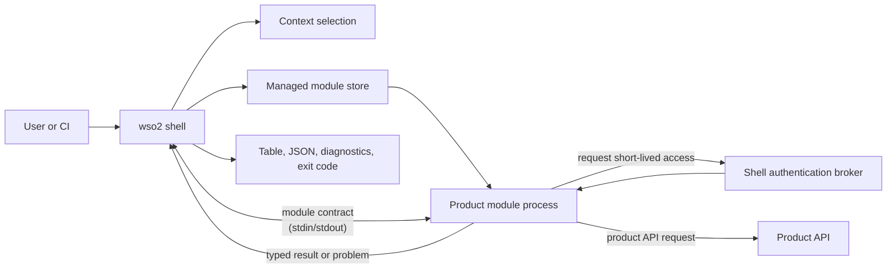
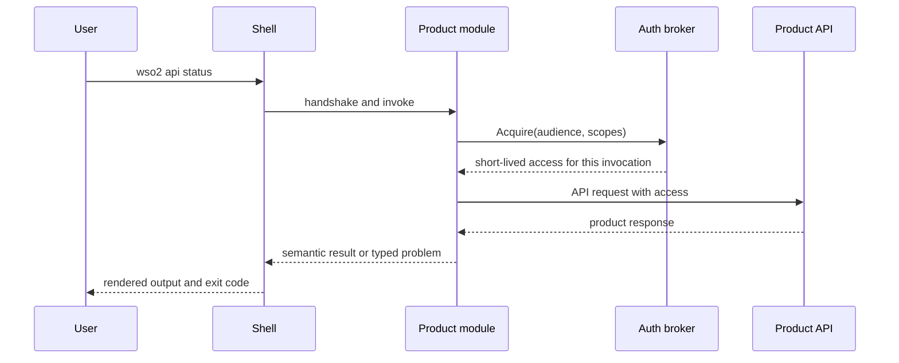
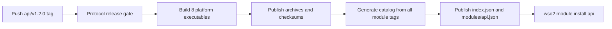

# Building a product module

**Status:** Working draft  
**Related:** [Architecture](../architecture.md),
[module catalog](../reference/module-catalog.md),
[release artifacts](../reference/release-artifacts.md),
[contributing](../../CONTRIBUTING.md)  
**Last reviewed:** 2026-08-20

The single-repository layout this guide describes is
[ADR 0006](../adr/0006-monorepo-modules-and-generated-catalog.md), which is
proposed rather than accepted. Read this as the shape the path will take, not
as a path that is open today.

This guide is for a WSO2 product team adding a module to this repository. A
product module owns one top-level command namespace, such as `api`, and is an
independently versioned executable. The shell owns installation, contexts,
credentials, protocol negotiation, and user-facing output; the module owns the
product commands and calls to its product API.

The [`modules/reference`](../../modules/reference/) module is the small,
non-product example used throughout this guide. Its `whoami` command shows the
complete path from a command handler, through brokered access, to a typed
result. Do not publish or assign the reserved `reference` namespace to a
product.

## The model to keep in mind



The process boundary is intentional. It lets a product release without a shell
release, while keeping common security and UX policy in one place.

| The module author owns | The shell and SDK own |
| --- | --- |
| Namespace-specific commands, validation, product API calls, semantic results, and typed product errors | Command dispatch, installed-version selection, context selection, credential storage, access-token policy, protocol framing, output rendering, diagnostics, and exit-code mapping |

Two rules follow from this split:

1. A module imports the public `github.com/wso2/wso2-cli/sdk/...` packages, but
   never a shell `internal/...` package.
2. A module never writes terminal output to standard output. Standard output is
   reserved for the module contract; return a `result.Result` or a typed
   `problem.Problem` and let the shell render it.

## 1. Create the module shape

Each module is an independent Go module below `modules/`. The directory name
is a source-location choice; `module.json` declares the namespace that users
type.

```text
modules/<product>/
├── go.mod
├── module.json
└── cmd/
    └── wso2-module-<namespace>/
        └── main.go
```

For a product namespace called `api`, the release tooling expects the main
package at `modules/api/cmd/wso2-module-api` and packages an executable named
`wso2-module-api` (or `wso2-module-api.exe` on Windows).

Start with a `module.json` beside `go.mod`:

```json
{
  "schemaVersion": 1,
  "namespace": "api",
  "compatibility": {
    "shell": ">=0.1.0 <2.0.0",
    "protocolVersions": [2]
  },
  "capabilities": {
    "authAudiences": ["api.example.com"],
    "authScopes": ["api:read"]
  }
}
```

Choose a namespace before implementation. It is the user's top-level command,
the tag prefix, catalog identity, executable name, and installed-store key.
Changing it later is a migration, not a rename.

`compatibility.protocolVersions` declares the module contract versions the
release supports. The protocol comes from the SDK your module is built with;
do not invent a version or compare your product version with the shell version.
The release gate accepts a module only when its declared protocol intersects
the protocol window of an already released shell.

`capabilities` are the maximum audiences and scopes the module may request.
Keep them equal to the `module.Options` declaration in the executable. Catalog
installation records these values in the local receipt, and the broker refuses
an access request that the receipt did not authorize.

## 2. Build commands with the SDK

The module executable supplies its identity and maps command paths to handlers.
The SDK handles handshake, framing, access-broker messages, result validation,
and protocol failures.

```go
package main

import (
	"context"
	"fmt"
	"os"

	"github.com/wso2/wso2-cli/sdk/module"
	"github.com/wso2/wso2-cli/sdk/result"
)

const (
	namespace = "api"
	audience  = "api.example.com"
	scope     = "api:read"
)

var moduleVersion = "0.0.0-dev"

func main() {
	err := module.Serve(context.Background(), module.Options{
		Namespace:     namespace,
		Version:       moduleVersion,
		AuthAudiences: []string{audience},
		AuthScopes:    []string{scope},
	}, module.Command{Path: []string{"status"}, Run: status})
	if err != nil {
		fmt.Fprintln(os.Stderr, err)
		os.Exit(1)
	}
}

func status(ctx context.Context, request module.Request) (result.Result, error) {
	return result.New("api.status/v1").With("status", "Status", "ready"), nil
}
```

The release tool injects `moduleVersion` from the module tag. Keep the
development value in source; do not hard-code a release version.

A handler receives the selected non-secret context, original product arguments,
requested output mode, a per-invocation ID, and an access broker. It does not
receive refresh tokens, client secrets, or the shell configuration store.

## 3. Request access only when the command needs it

For a protected product API, request access through `request.Access`. The shell
intersects the request with the installed module's declared capabilities, finds
the selected context, and returns short-lived access for this one invocation.

```go
access, err := request.Access.Acquire(ctx, module.AccessRequest{
	Audience: audience,
	Scopes:   []string{scope},
})
if err != nil {
	// This is a shell policy denial. Return it unchanged.
	return result.Result{}, err
}

response, err := callProductAPI(ctx, request.Context.Endpoint, access.Token)
if err != nil {
	return result.Result{}, err
}
return result.New("api.status/v1").
	With("status", "Status", response.Status), nil
```

The access token is opaque to the module. Do not parse it, log it, return it,
persist it, or pass it in command-line arguments. A module can spend access on
its product API but cannot refresh or broaden it.

The following request flow is what the module must preserve:



## 4. Use `reference whoami` as the concrete example

`wso2 reference whoami` is deliberately small but exercises every important
boundary:

1. [`main.go`](../../modules/reference/cmd/wso2-module-reference/main.go)
   registers the `whoami` command and declares the `reference-status` audience
   and `reference:status:read` scope.
2. The `whoami` handler acquires that declared access through the broker.
3. [`whoami.go`](../../modules/reference/cmd/wso2-module-reference/whoami.go)
   calls the service endpoint from the selected context, sending the opaque
   access token and invocation ID.
4. The service verifies the token and returns non-secret claims: organization,
   audiences, scopes, and invocation binding.
5. The handler returns those claims as `reference.whoami/v1`; the shell renders
   them as a table or deterministic JSON.

This command proves the correct boundary: the service that verifies access says
what it conveys. The module never tries to inspect the token itself, and no
access material appears in its result or diagnostics.

## 5. Develop and test locally

During this move, `go.work` composes the shell, SDK, and reference module. Run
the smallest relevant checks while working, then the repository acceptance
gate before review:

```sh
# From the repository root.
go build ./...
(cd modules/reference && go test ./...)

# The SDK must also work outside workspace composition.
(cd sdk && GOWORK=off go test ./...)

# Full shell–module contract and acceptance proof.
./scripts/acceptance.sh
```

Unit-test handlers with [`sdk/testkit`](../../sdk/testkit/), which runs a
command through the real protocol framing with access you supply, so a test
covers the handler and its contract rather than the handler alone. `testkit.Run`
takes the module options and commands; `testkit.Access` grants a token or, with
`Deny`, returns a broker denial. Do not make unit tests depend on a real
identity provider. Add acceptance coverage when a command changes
the shell/module boundary, access behavior, output schema, or a security
property. The reference `whoami` acceptance tests are the example for an
access-reporting command: they verify table output, JSON field order,
per-invocation binding, and that no access material is printed.

Use the SDK as a normal published dependency in a real product repository. A
module's `go.mod` must not contain a `replace` directive. The workspace
replacement in this repository is temporary local composition for the
unpublished SDK and must not be copied into a product module.

## 6. Release and publish the catalog entry

One module tag triggers the complete release flow. For namespace `api`, tag a
semantic version in this form:

```text
api/v1.2.0
```

The tag is a module release, not a shell or SDK release. The workflow performs
the following sequence:



The release tool builds archives for the supported shell platforms, injects the
module version, and publishes `checksums.txt`. Catalog generation then reads
the tag, the `module.json` as it existed at that tag, and the published assets.
No one hand-authors a catalog entry.

The shell discovers a module from `index.json`, fetches that namespace's
history only when it must select a version, verifies the downloaded archive
against its catalog digest, and atomically activates the new installed version.
Normal product commands run from that local managed store and do not need the
catalog.

For a local release-artifact check without publishing, run:

```sh
go run ./cmd/wso2-module-release -tag api/v1.2.0 -out dist
```

Run this only after the new module is present under `modules/` with a valid
declaration. It writes build artifacts to `dist/`; do not commit those output
files.

## Product-module checklist

Before asking for review, confirm that:

- the namespace is assigned and appears identically in `module.json`,
  `module.Options`, executable path, and intended tag;
- the module imports public SDK packages only and has no `replace` directive;
- every access audience and scope requested at runtime is declared in both
  `module.json` and `module.Options`;
- handlers return semantic `result.Result` values or typed problems, rather
  than formatting output or choosing exit codes;
- access tokens and other credentials cannot reach output, logs, files,
  arguments, or environment variables;
- unit and acceptance tests cover the new command's behavior; and
- `./scripts/acceptance.sh` passes from a clean checkout.
