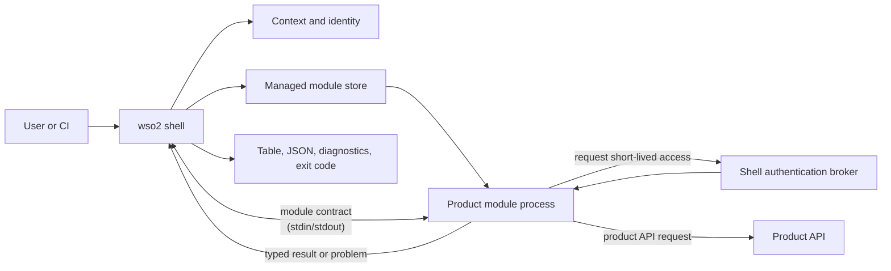
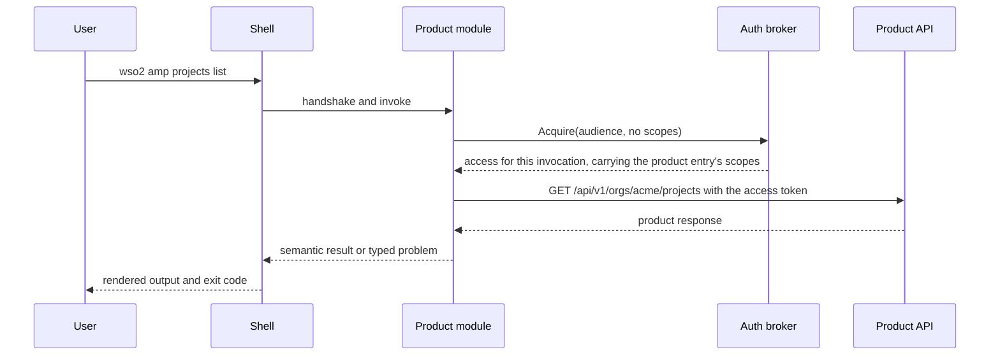
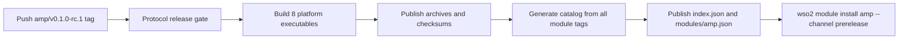

# Building a product module

**Status:** Working draft  
**Related:** [Architecture](../architecture.md),
[module catalog](../reference/module-catalog.md),
[release artifacts](../reference/release-artifacts.md),
[module manifest](../reference/module-manifest.md),
[module SDK](../reference/module-sdk.md),
[shell commands](../reference/commands.md),
[troubleshooting](troubleshooting-modules.md),
[ADR 0011](../adr/0011-local-module-install-through-a-development-origin.md),
[ADR 0014](../adr/0014-one-login-one-session-per-product.md),
[contributing](../../CONTRIBUTING.md)  
**Last reviewed:** 2026-09-07

The single-repository layout this guide describes is
[ADR 0006](../adr/0006-monorepo-modules-and-generated-catalog.md). A product
module lives here and is released by its own tag, on its own schedule: the
single repository removes the cross-repository trust plumbing, not the
independent release.

This guide is for a WSO2 product team adding a module to this repository. A
product module owns one top-level command namespace, such as `apim`, and is an
independently versioned executable. The shell owns installation, contexts,
identities, credentials, protocol negotiation, and user-facing output; the
module owns the product commands and calls to its product API.

Every step below was run, in order, to build [`modules/amp`](../../modules/amp/),
the Agent Manager module. It is the worked example throughout: a scaffolded
module, a client on the product's REST API, two read-only commands, tests
against a fake deployment, and an installation under a real shell. Where a step
prints something, what is shown is what it printed. The
[`modules/iam`](../../modules/iam/) and [`modules/apim`](../../modules/apim/)
modules are the larger examples, each with a one-time `bootstrap` and a product
descriptor; [`modules/reference`](../../modules/reference/) is the non-product
module the shell's own tests use, and its `reference` namespace is reserved.

## The model to keep in mind



The process boundary is intentional. It lets a product release without a shell
release, while keeping common security and UX policy in one place.

| The module author owns | The shell and SDK own |
| --- | --- |
| Namespace-specific commands, flags, validation, product API calls, semantic results, and typed product errors | Command dispatch, installed-version selection, context and identity selection, credential storage, session acquisition, access-token policy, protocol framing, output rendering, diagnostics, and exit-code mapping |

Three rules follow from this split:

1. A module imports the public `github.com/wso2/wso2-cli/sdk/...` packages, but
   never a shell `internal/...` package.
2. A module never writes terminal output to standard output. Standard output is
   reserved for the module contract; return a `result.Result` or a typed
   `problem.Problem` and let the shell render it.
3. A module never holds a credential. It asks the broker for access per
   invocation, spends it on its product API, and cannot refresh or widen it.

## 1. Create the module

One command creates the module, and what it creates builds and passes its own
tests with nothing edited:

```console
$ make new-module NAMESPACE=amp
go run ./cmd/wso2-module-new -namespace 'amp'
Created the amp module in modules/amp:
  modules/amp/go.mod
  modules/amp/module.json
  modules/amp/README.md
  modules/amp/cmd/wso2-module-amp/main.go
  modules/amp/cmd/wso2-module-amp/main_test.go

Build and test it:
  make test-module NAMESPACE=amp
Run it under a real shell:
  make install-module NAMESPACE=amp && ./bin/wso2 amp status
Then open modules/amp/cmd/wso2-module-amp/main.go
```

```console
$ make test-module NAMESPACE=amp
go test ./modules/amp/... -race -count=1
ok  	github.com/wso2/wso2-cli/modules/amp/cmd/wso2-module-amp	3.172s
ok  	github.com/wso2/wso2-cli/modules/amp/internal/amp	2.547s
```

Do not assemble a module by hand. The generator reads two facts from the
checkout that a hand-written module would have to guess and would then hold
wrongly for as long as nobody noticed: the SDK version to build against, and
the module contract versions to declare. It also adds the module to `go.work`,
so the SDK in the checkout is what the module compiles against while you work.

Choose the namespace before you run it. It is the user's top-level command, the
tag prefix, the catalog identity, the executable name, and the installed-store
key, so changing it later is a migration rather than a rename. Four kinds of
namespace are refused, and nothing is written when one is:

```console
$ make new-module NAMESPACE=login
go run ./cmd/wso2-module-new -namespace 'login'
wso2-module-new: "login" is a shell command, so a module owning that namespace could never be reached; the shell owns config, context, doctor, help, identity, login, logout, module, org, version, whoami
exit status 1
make: *** [new-module] Error 1
```

That refusal is the one worth understanding. The shell resolves its own commands
before it consults an installed module, so a module in a shadowed namespace
would build, release, install, and then never run: every invocation would reach
the shell command instead. The others are a namespace another module already
declares, the reserved `reference` namespace, and anything that is not lowercase
letters and digits starting with a letter.

### What it wrote

```text
modules/amp/
├── go.mod
├── module.json
├── README.md
└── cmd/
    └── wso2-module-amp/
        ├── main.go
        └── main_test.go
```

The directory name is a source-location choice; `module.json` declares the
namespace users type. The release tooling expects the main package at
`modules/<namespace>/cmd/wso2-module-<namespace>` and packages an executable of
that name.

```json
{
  "schemaVersion": 1,
  "namespace": "amp",
  "compatibility": {
    "shell": ">=0.1.0 <2.0.0",
    "protocolVersions": [2]
  },
  "capabilities": {
    "authAudiences": [],
    "authScopes": []
  }
}
```

Every field here is stated in full, with what reads it and what refuses when it
is wrong, in the [module manifest reference](../reference/module-manifest.md).
The parts worth meeting now are these.

`compatibility.protocolVersions` is the module contract versions this release
supports, and it was read from the SDK in your checkout rather than chosen. Do
not invent a version and do not compare your product version with the shell
version: the release gate accepts a module only when its declared protocol
intersects the protocol window of an already released shell.

`capabilities` are the maximum audiences and scopes the module may ever request,
and they are empty because a new module asks the shell for nothing yet. Keep
them equal to the `module.Options` declaration in the executable. Installation
records them in the local receipt, and the broker refuses an access request the
receipt did not authorize, so an audience you add in one place and not the
other is refused at runtime rather than at build time. A third member,
`product`, is met in section 4.

The generated `main.go` serves one `status` command and already follows the
conventions the rest of this guide explains: it serves a declared command tree,
every result ends with a `next` field, and nothing is printed.

#### Declare a logical audience, never a deployment value

The audience your module declares is **the stable name your API is known by**,
compiled in and identical against every deployment your module will ever run
against. It is not the string any particular identity provider puts in a token's
`aud` claim, and it must never be a client ID, a tenant URL, or anything else
that differs between one customer and the next.

That is not a style preference; the deployments the shell supports each bind
`aud` differently: to the client ID on Asgardeo and API Manager, to the API
resource identifier on Identity Server, and to a resource-server URI on
ThunderID. A module that compiled any one of those in would be installable only
against the single tenant it was built for.

The operator records the concrete value on the identity's product entry for
your namespace, either by hand or through `wso2 <namespace> connect`, and the
shell proves the issued token is bound to *that* before handing anything over.
So the deployment-specific half of the problem belongs to the person who
registered the application, and never to you. Ask for your logical name and let
the shell do the rest. The `amp` module asks for `amp-api`; on a real Agent
Manager deployment the operator records the resource URL its bundled ThunderID
binds tokens to.

### The versions your module depends on

```text
require (
	github.com/spf13/cobra v1.10.2
	github.com/wso2/wso2-cli/sdk v0.2.0
)
```

The SDK version is the published one every module in this repository builds
against, and it is worth knowing what it does and does not promise. It says
which Go API your module compiled against, and nothing more. Below `1.0` it may
break on a minor bump, so read the SDK's release notes before moving it. Every
module here requires the same SDK version, and a boundary test says so.

What decides whether a user's shell can launch your module is the **protocol
version**, which is versioned separately, declared in `module.json`, checked by
the release gate, and negotiated at every invocation. Two modules built against
different SDK versions run on the same shell if they speak a protocol it speaks.
See [ADR 0009](../adr/0009-sdk-versioning-and-publication.md).

## 2. Build commands with the SDK

The module executable supplies its identity and maps command paths to handlers.
The SDK handles handshake, framing, access-broker messages, result validation,
and protocol failures.

### Serve a Cobra tree, and serve the tree itself

A module's commands are an ordinary Cobra tree, so a product CLI being migrated
keeps its commands, flags, and help where they are. Only the ending changes: a
handler returns typed fields instead of printing. This is how the `amp` module
declares its two families and binds them:

```go
func commands() *cobratree.Tree {
	root := &cobra.Command{Use: Namespace, Short: "Amp commands for the WSO2 CLI."}
	statusCommand := &cobra.Command{Use: "status", Short: "Report this module's own status and what to run first."}
	projects, projectsListCommand := projectCommands()
	agents, agentsListCommand := agentCommands()
	root.AddCommand(statusCommand, projects, agents)

	return cobratree.New(root).
		Handle(statusCommand, status).
		Handle(projectsListCommand, projectsList(projectsListCommand)).
		Handle(agentsListCommand, agentsList(agentsListCommand))
}

func main() {
	if err := commands().Serve(context.Background(), moduleOptions()); err != nil {
		fmt.Fprintf(os.Stderr, "wso2-module-amp: %v\n", err)
		os.Exit(1)
	}
}
```

Return the tree and call `Serve` on it, rather than handing `module.Serve` the
commands it holds. `Serve` declares the tree as well as serving it, and that
declaration is what lets the shell answer `wso2 amp --help`, name a mistyped
command, and refuse an unknown flag before your module is launched:

```console
$ wso2 amp project list
error: the amp module has no "project" command (shell.unknown_product_command)
  Did you mean wso2 amp projects?
$ wso2 amp projects list --nope
error: wso2 amp projects list does not take --nope (shell.unknown_product_flag)
  Run wso2 amp projects list --help to see the flags it accepts.
```

A module that serves a command list alone declares nothing, and the shell falls
back to parsing a product line without knowing what the module accepts: the
leading plain words are the command, and everything from the first flag the
shell does not recognize goes to the module unread, `--output` included. The
generated module already serves the tree, and its generated test fails if it
stops.

### A handler reads the flags the tree parsed for it

The adapter parses the module's arguments with the matched command's flag set
before the handler runs. A handler that needs flags is written as a closure
over the command it was declared beside:

```go
func projectsList(command *cobra.Command) module.Handler {
	return func(ctx context.Context, request module.Request) (result.Result, error) {
		org, err := organization(command, request)   // --org, else request.Context.OrganizationID
		if err != nil {
			return result.Result{}, err
		}
		client, err := managementClient(ctx, request) // section 3
		if err != nil {
			return result.Result{}, err
		}
		var listed projectList
		if err := client.Get(ctx, "/orgs/"+org+"/projects"+pagination(command), &listed); err != nil {
			return result.Result{}, amp.Problem(err, "the project listing")
		}
		return result.New(ProjectsSchema).
			With("organization", "Organization", org).
			With("count", "Count", fmt.Sprintf("%d", listed.Total)).
			With("projects", "Projects", joined(names)).
			With(NextField, "Next", next), nil
	}
}
```

A handler receives the selected non-secret context (its name, organization,
and the product endpoint recorded for your namespace), the original product
arguments, the requested output mode, a per-invocation ID, and an access broker.
It does not receive refresh tokens, client secrets, or the shell configuration
store.

### Results, problems, and the `next` field

A result is a schema name and fields in presentation order; the shell renders
the same result as a table or as JSON, and the field order is part of the
answer. Every result the `amp`, `iam`, and `apim` modules return ends with a
field named `next` whose value is the command a user most likely runs next, and
the shell renders that field as a trailing line. Follow the convention: the
generated `status` does, and its generated test checks it.

A failure is a `problem.Problem`: a category, a stable code prefixed with your
namespace, a message, and recovery text. The category is your one exit-code
decision, made by naming the class of failure. A product API that answered with
an error is `product_service`; a user who typed the wrong flag is `usage`. The
`amp` module's client turns every transport outcome into one of four problems,
`amp.refused` with the deployment's own words, `amp.unavailable`,
`amp.unreadable`, and `amp.certificate_untrusted` with the two commands that
trust the certificate, so a handler never has to interpret an HTTP error itself.

Two things the adapter guarantees without being asked. Every writer in the tree
points at standard error, and Cobra prints neither errors nor usage itself, so
the tree cannot write to standard output. And a flag failure reaches the shell
as a typed usage problem rather than as Cobra's own error text.

The limit is worth knowing: a handler that calls `fmt.Println` writes to
standard output and corrupts the stream. No adapter can prevent that. Send
diagnostics to standard error, and return everything the user should see as
result fields.

### Three flag names are never yours

`--context` selects the shell's context, `--output` selects the rendering, and
`--no-input` asks that nothing prompt or open a browser. The shell reads all
three wherever they are written on a product command line and never forwards
them. A product concept that shares a word needs another name; the `apim`
module calls an API's context path `--api-context`. What `--no-input` means to
your module is in the next section.

## 3. Request access only when the command needs it

For a protected product API, request access through `request.Access`. The shell
intersects the request with the installed module's declared capabilities, finds
the selected context and identity, obtains or reuses the product's session, and
returns short-lived access for this one invocation.

```go
func managementClient(ctx context.Context, request module.Request) (*amp.Client, error) {
	access, err := request.Access.Acquire(ctx, module.AccessRequest{Audience: APIAudience})
	if err != nil {
		// A shell policy denial. Return it unchanged.
		return nil, err
	}
	if request.Context.Endpoint == "" {
		return nil, problem.New(problem.CategoryUsage, "amp.no_endpoint",
			"the selected context does not name an Agent Manager endpoint").
			WithRecovery("Record it: wso2 identity add-product <identity> amp --endpoint <url> ...")
	}
	return amp.New(request.Context.Endpoint, access.Token), nil
}
```

### Ask for no scopes unless a command needs fewer than the product records

The request above names an audience and no scopes. That is deliberate. A
request with no scopes asks for exactly the scopes recorded on the identity's
product entry for your namespace, which the user, or your product's `connect`,
wrote down when the product was recorded. Those recorded scopes are the ceiling
for every request whichever party named them, and a scope neither your receipt
nor the entry declares is refused with `auth.scope_not_declared`. So a module
declares the scopes its commands can ever need once, in `module.json` and
`module.Options`, and its commands stop carrying a `--scope` flag. Name scopes
in a request only when one command should hold less than the entry allows.

The access token is opaque to the module. Do not parse it, log it, return it,
persist it, or pass it in command-line arguments. A module can spend access on
its product API but cannot refresh or broaden it.

### What a module process can see

Brokered access is the only credential a module is meant to hold, and the shell
launches a module with an environment built from nothing to keep it that way.
Three things are added back:

- `WSO2_CA_FILE`, the PEM file of certificates the shell itself trusts beside
  the system roots. A module is a separate process, so it has to apply the same
  trust on its own; the `amp` client's `HTTPClient` does, and the `iam` and
  `apim` clients are the same.
- `WSO2_NO_INPUT=1`, when `--no-input` or the `WSO2_NO_INPUT` variable asked
  that nothing prompt. A module cannot prompt anyway, because its standard
  streams carry the protocol, so what this tells a module is to refuse rather
  than wait where it otherwise might, and to expect no browser.
- Every variable named `WSO2_<NAMESPACE>_*` for the module's own namespace,
  upper-cased: `WSO2_AMP_*` for `amp`. Nothing else the user or a CI runner
  exported reaches the module, and no module sees another's variables.

That last prefix is how a secret the broker cannot supply reaches a command. A
one-time `bootstrap` that registers the CLI with a product administrator's
password takes the variable's *name* as a flag, `--password-variable`
defaulting to something like `WSO2_IAM_ADMIN_PASSWORD`, and reads the value
from the environment. Never take the value as a flag: it would land in shell
history and in the diagnostics the shell records.

The following request flow is what the module must preserve:



## 4. Tell the shell how your product is reached

Before any command of yours can run, the user's identity has to record your
product: where it runs, what audience its tokens carry, and which scopes it
needs. There are two ways that record gets written, and which one your module
supports is decided by one field of `module.json`.

### A module with a product descriptor: `wso2 <namespace> connect <url>`

`capabilities.product` is a **product descriptor**: what your module declares
about reaching your product, so the shell can write the whole record from a
URL. `connect` is the shell's own subcommand of every installed namespace, read
before the module is launched, and it writes nothing to the secure store and
makes no network call. The `iam` module declares that ThunderID is itself an
identity provider, so `wso2 iam connect <url>` creates the identity and the
context too; the `apim` module declares that API Manager is reached through a
federated grant at its own issuer, so `wso2 apim connect <url> --client-id <id>`
attaches it to the identity already logged in. Every field, and what refuses
when it is wrong, is in the [module manifest reference](../reference/module-manifest.md#capabilitiesproduct).

Declare one when the product's issuer can be named from the product's own URL,
which is the case for a product that is its own identity provider and for a
product whose issuer lives at a fixed path under its URL. Give your `status`
command a `next` line that names the `connect` command, and if a `bootstrap`
registers the CLI's client, have it print the exact `connect` line to run.

### A module without one: `wso2 identity add-product`

Agent Manager's API is a resource server protected by a ThunderID the
deployment bundles at a host of its own, `http://thunder.amp.localhost:8080`
beside an API at `http://localhost:9000` in its local deployment, and its own
CLI finds that issuer by reading RFC 9728 protected-resource metadata from the
product URL. The descriptor cannot express an issuer that is not derivable from
the URL, so the `amp` module declares none, and the shell says so when asked:

```console
$ wso2 amp connect http://localhost:9000
error: the amp module declares no product descriptor, so the shell cannot write its record from a URL (shell.connect_unsupported)
  Record the product with wso2 identity add-product <identity> amp --endpoint <url> [--audience <value>] [--scopes <list>], or install a version of the module that declares one.
```

The user records the product by hand on an identity that logs in at that
ThunderID, and the module's `status` says exactly that:

```console
$ wso2 amp status
NAMESPACE   VERSION     ENDPOINT
amp         0.0.0-dev

Next  Record where Agent Manager runs on the identity you log in with: wso2 identity add-product <identity> amp --endpoint <url> --audience <resource> --scopes amp:project:read,amp:agent:read, then wso2 login.
```

```sh
wso2 iam connect http://thunder.amp.localhost:8080 --identity amp-dev --audience http://localhost:9000
wso2 identity add-product amp-dev amp --endpoint http://localhost:9000 \
  --audience http://localhost:9000 --scopes amp:project:read,amp:agent:read
wso2 login
wso2 org use <organization>
wso2 amp projects list
```

Whichever way the record is written, the shell then obtains the product's
session by the strategy the record implies, `direct`, `derived`, `federated`,
or `sibling`, and your module sees none of it: it asks the broker and receives
access. See [ADR 0014](../adr/0014-one-login-one-session-per-product.md).

The gap is worth stating plainly: a product whose issuer must be discovered
from the product rather than derived from its URL cannot be `connect`ed today.
Extending the descriptor to carry a discovery method is a shell change, tracked
separately; a module in that position ships without a descriptor and points at
`add-product`, as `amp` does.

## 5. Develop and test locally

### Unit tests through the contract, against a fake product

Unit-test handlers with [`sdk/testkit`](../../sdk/testkit/), which runs a
command through the real protocol framing with access you supply, so a test
covers the handler and its contract rather than the handler alone.
`testkit.Run` takes the module options, the commands, and an invocation
carrying the context and the access to grant; `testkit.Access` grants a token
or, with `Deny`, returns a broker denial. Do not make unit tests depend on a
real identity provider or a real deployment. The `amp` module's tests stand up
an `httptest` server that answers its two listings behind a bearer check, run a
command against it, and then assert the path the module called, that it asked
the broker for its audience and no scopes, the fields it returned in order, and
that the result ends with `next`:

```go
outcome := testkit.Run(context.Background(), moduleOptions(), commands().Commands(), testkit.Invocation{
	Command:   []string{"projects", "list"},
	Arguments: []string{"--org", "other", "--limit", "5"},
	Context:   module.Context{Name: "amp-dev", OrganizationID: "acme", Endpoint: fake.server.URL},
	Access:    &testkit.Access{Token: fixtureToken, ExpiresAt: time.Now().Add(time.Minute)},
})
```

Check `outcome.Err` first, then exactly one of `outcome.Result` and
`outcome.Problem` is set, and `outcome.AccessRequests` records what the module
asked the broker for. The test kit is a conforming peer rather than the shell:
it performs no receipt resolution, no integrity check, no rendering, and it
never intersects a request with declared capabilities. A handler asking for an
audience `module.json` does not declare passes its tests and is refused on a
user's machine with `auth.audience_not_declared`. The repository's boundary
test in `internal/boundaries` closes that gap for every module under
`modules/`: it compares `module.json` with the `module.Options` the executable
serves, in both directions, and asserts that no module imports a shell
`internal` package or writes to standard output.

```sh
make test-module NAMESPACE=amp
go test ./internal/boundaries/
```

### Run it under the real shell before you tag

Install your unpublished module and find out:

```console
$ make install-module NAMESPACE=amp
...
Built bin/wso2 reporting version 1.0.0-dev.
...
Installed amp v0.0.0-dev for darwin/arm64 into .../cli/modules.
It was installed by the ordinary installer from a catalog served at http://127.0.0.1:53398 for the length of this run.
The version is pinned, so wso2 module update leaves this build alone.
```

The module is built, packed, and installed by the ordinary installer, reading a
catalog generated by the published generator from an origin that lives on
loopback for the length of the run. Nothing about the installation is made
easier, so what lands in your module store is a real installation. Set
`WSO2_HOME` to an empty directory first if you would rather not touch your own
installed modules. Installation runs the executable once to read the command
tree it declares, and from then on the shell parses your command lines from the
receipt:

```console
$ ./bin/wso2 version
WSO2 CLI   v1.0.0-dev
Protocol   v2, v1
Platform   darwin/arm64

Installed modules
NAME   VERSION      PLATFORM
amp    v0.0.0-dev   darwin/arm64
$ ./bin/wso2 amp --help
Amp commands for the WSO2 CLI.

Usage:
  wso2 amp <command> [flags]

Commands:
  agents    Read the agents a project deploys.
  projects  Read the projects an organization holds.
  status    Report this module's own status and what to run first.
...
$ ./bin/wso2 amp projects list --org acme
error: the "amp" module needs access, and no WSO2 CLI context is selected (auth.context_not_selected)
  Run wso2 context use <name> to select a configured context, or wso2 login --url <issuer> --client-id <id> to create an identity and a context. wso2 context list shows what is configured.
```

That last refusal is the shell's, and it is what a correctly written module
produces on a machine that has not been set up yet. Take the module off again
with `./bin/wso2 module remove amp`.

`install-module` builds the shell as well, which is why one command is enough
and why it prints `./bin/wso2` rather than `wso2`. A shell built the ordinary
way reports `0.0.0-dev`, and the shell range your `module.json` declares does
not contain it, because a prerelease sorts below its own release and the range
starts at `>=0.1.0`. Such a shell installs a module and then refuses to launch
it, so the module is installed for the version that same run built.
`SHELL_VERSION` overrides that version, and `VERSION` names another module
version, for rehearsing what a specific release looks like installed.

Installing for a released `wso2` takes one more fact, because its version says
nothing about the module-contract protocol it speaks, and that is what selection
decides over. Run the command directly and tell it, using what `wso2 version`
prints:

```sh
go run ./cmd/wso2-module-dev -namespace amp \
  -shell-version 1.2.0 -shell-protocols 2,1 -shell-path /usr/local/bin/wso2
```

Naming another shell's version without its protocol window is refused rather
than assumed. See
[ADR 0011](../adr/0011-local-module-install-through-a-development-origin.md)
for why this goes through the real catalog rather than writing the store entry
directly.

### Acceptance coverage for the shell boundary

Add acceptance coverage when a command changes the shell/module boundary,
access behavior, output schema, or a security property. The acceptance package
in `test/acceptance` builds the shell and a module, installs the module into an
isolated state root, writes a context document, and runs the shell as a
subprocess against a fake issuer and a fake product. The `amp` module's test
proves what this guide claims about it: a client-credentials identity whose
product entry records two scopes runs `wso2 amp projects list`, the token the
module presents to the fake Agent Manager is one the fake issuer minted for
exactly those two scopes and the declared audience, the paths called are the
ones Agent Manager serves, and `connect` is refused with the recovery above.

```sh
go test ./test/acceptance/ -run TestTheAmpModule
./scripts/acceptance.sh   # the whole gate, before review
```

Use the SDK as a normal published dependency. A module's `go.mod` must not
contain a `replace` directive; the workspace is the one sanctioned place for
one, and only while an SDK release is in flight.

## 6. Release and publish the catalog entry

One module tag triggers the complete release flow. For namespace `amp`, tag a
semantic version in this form:

```text
amp/v0.1.0-rc.1
```

The tag is a module release, not a shell or SDK release. The workflow performs
the following sequence:



The release tool builds archives for the supported shell platforms, injects the
module version and the SDK version the module was built against, and publishes
`checksums.txt`. Catalog generation then reads the tag, the `module.json` as it
existed at that tag, its `capabilities` and product descriptor included, and
the published assets. No one hand-authors a catalog entry.

Run the gate alone before you tag, and it answers the only question a tag
cannot take back, which is whether any shell that exists can launch what you
are about to publish:

```console
$ make gate-module NAMESPACE=amp VERSION=v0.1.0-rc.1
go run ./cmd/wso2-module-release -tag 'amp/v0.1.0-rc.1' -gate-only
amp/v0.1.0-rc.1 speaks module-contract protocol v2 and the released shell speaks v2, v1
```

For the full artifact check without publishing:

```console
$ go run ./cmd/wso2-module-release -tag amp/v0.1.0-rc.1 -out dist
...
8 archives and checksums.txt written into dist
```

It writes build artifacts to `dist/`; do not commit them.

A version carrying a prerelease identifier, such as `amp/v0.1.0-rc.1`, is
published on the prerelease channel: it is installable by anyone who asks for
that channel and is offered to nobody following the stable one. That is the
channel to release a first module on.

## 7. Install, update, and remove it

The other end of the lifecycle is what a user does, and it is worth running
once rather than reading about. What follows runs against the module this
repository has actually published, `modules/reference`, reading the deployed
catalog at `https://wso2.github.io/wso2-cli` on the prerelease channel.
`WSO2_HOME` is set to an empty directory first so the run starts from no
installed modules and no receipts:

```console
$ export WSO2_HOME=$(mktemp -d)
$ wso2 module available
MODULE      CHANNEL      VERSION
reference   prerelease   v0.1.0-rc.4

Run wso2 module install <module> to install one.
```

Installing without naming a channel resolves the stable channel, and the
reference module has never published to it:

```console
$ wso2 module install reference
error: the "reference" module publishes no version on the stable channel (catalog.empty_channel)
  It publishes on prerelease. Choose one with --channel.
$ wso2 module install reference --channel prerelease
Installed reference v0.1.0-rc.4 for darwin/arm64.
The artifact was checked against the digest the catalog publishes. Artifacts are integrity-checked, not signed.
```

Asking for a channel rather than a version resolves the newest version on that
channel this shell can launch on this platform, verifies the archive against
the digest the catalog published, and writes a receipt recording what it
installed. Pinning an exact version with `<namespace>@<version>` is what a
pipeline does instead, so its behavior does not depend on what is newest that
day.

```console
$ wso2 module list
MODULE      INSTALLED     CHANNEL      UPDATE
reference   v0.1.0-rc.4   prerelease   current

Every installed module is current.
$ wso2 module update reference
reference is current at v0.1.0-rc.4.
```

`wso2 module update --all` does the same for every installed module at once,
and asks for confirmation first unless you pass `--yes`.

Removing takes the module off the machine, meaning its versions, its receipts,
its active-version pointer, and its version policy, and touches nothing else. It
is not a logout: your configuration, identities, and credentials are left as
they were.

```console
$ wso2 module remove reference --yes
Removed the reference module.
$ wso2 module remove reference --yes
error: no reference module is installed (shell.module_not_installed)
  Run wso2 module list to see what is installed.
```

Remove and reinstall freely while iterating: removal leaves no receipt or
version directory behind, so the next install resolves cleanly rather than
against something you already discarded.

## Product-module checklist

Before asking for review, confirm that:

- the module was created with `make new-module`, rather than assembled by
  hand;
- the namespace is assigned and appears identically in `module.json`,
  `module.Options`, executable path, and intended tag;
- the module imports public SDK packages only and has no `replace` directive;
- the executable serves its Cobra tree with `cobratree.Tree.Serve`, so the
  shell can parse its command lines;
- every access audience and scope a handler can request is declared in both
  `module.json` and `module.Options`, and commands ask for no scopes unless
  one needs fewer than the product records;
- the module declares a product descriptor when its issuer can be named from
  its URL, and otherwise its `status` names `wso2 identity add-product`;
- handlers return semantic `result.Result` values ending in a `next` field, or
  typed problems, rather than formatting output or choosing exit codes;
- access tokens and other credentials cannot reach output, logs, files,
  arguments, or environment variables, and any secret a command needs is
  read from a `WSO2_<NAMESPACE>_*` variable named on the command line;
- the generated tests still pass, unit tests drive the module through
  `sdk/testkit` against a fake deployment, and acceptance coverage exists for
  any new shell-boundary behavior;
- `make install-module` installs it and `./bin/wso2 <namespace> --help` shows
  its commands; and
- `./scripts/acceptance.sh` passes from a clean checkout.
