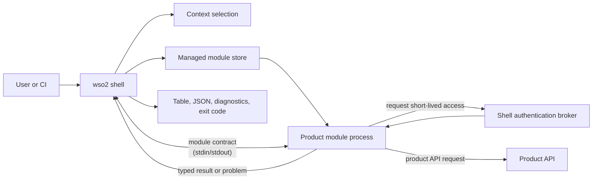
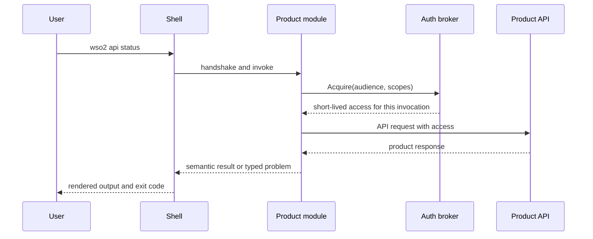
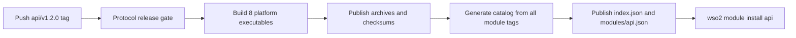

# Building a product module

**Status:** Working draft  
**Related:** [Architecture](../architecture.md),
[module catalog](../reference/module-catalog.md),
[release artifacts](../reference/release-artifacts.md),
[module manifest](../reference/module-manifest.md),
[module SDK](../reference/module-sdk.md),
[troubleshooting](troubleshooting-modules.md),
[ADR 0011](../adr/0011-local-module-install-through-a-development-origin.md),
[contributing](../../CONTRIBUTING.md)  
**Last reviewed:** 2026-08-30

The single-repository layout this guide describes is
[ADR 0006](../adr/0006-monorepo-modules-and-generated-catalog.md). A product
module lives here and is released by its own tag, on its own schedule: the
single repository removes the cross-repository trust plumbing, not the
independent release.

This guide is for a WSO2 product team adding a module to this repository. A
product module owns one top-level command namespace, such as `api`, and is an
independently versioned executable. The shell owns installation, contexts,
credentials, protocol negotiation, and user-facing output; the module owns the
product commands and calls to its product API.

The [`modules/reference`](../../modules/reference/) module is the small,
non-product example used throughout this guide. Its `whoami` command shows the
complete path from a command handler, through brokered access, to a typed
result. Do not publish or assign the reserved `reference` namespace to a
product.

## The model to keep in mind



The process boundary is intentional. It lets a product release without a shell
release, while keeping common security and UX policy in one place.

| The module author owns | The shell and SDK own |
| --- | --- |
| Namespace-specific commands, validation, product API calls, semantic results, and typed product errors | Command dispatch, installed-version selection, context selection, credential storage, access-token policy, protocol framing, output rendering, diagnostics, and exit-code mapping |

Two rules follow from this split:

1. A module imports the public `github.com/wso2/wso2-cli/sdk/...` packages, but
   never a shell `internal/...` package.
2. A module never writes terminal output to standard output. Standard output is
   reserved for the module contract; return a `result.Result` or a typed
   `problem.Problem` and let the shell render it.

## 1. Create the module

One command creates the module, and what it creates builds and passes its own
test with nothing edited:

```console
$ make new-module NAMESPACE=api
Created the api module in modules/api:
  modules/api/go.mod
  modules/api/module.json
  modules/api/README.md
  modules/api/cmd/wso2-module-api/main.go
  modules/api/cmd/wso2-module-api/main_test.go

Build and test it:
  go test ./modules/api/...
Then open modules/api/cmd/wso2-module-api/main.go
```

```console
$ go test ./modules/api/...
ok  	github.com/wso2/wso2-cli/modules/api/cmd/wso2-module-api	0.618s
```

Do not assemble a module by hand. The generator is not a convenience over a
documented layout: it reads two facts from the checkout that a hand-written
module would have to guess and would then hold wrongly for as long as nobody
noticed: the SDK version to build against, and the module contract
versions to declare.

Choose the namespace before you run it. It is the user's top-level command, the
tag prefix, the catalog identity, the executable name, and the installed-store
key, so changing it later is a migration rather than a rename. Four namespaces
are refused, and nothing is written when one is:

```console
$ make new-module NAMESPACE=login
wso2-module-new: "login" is a shell command, so a module owning that namespace could never be reached; the shell owns help, login, module, version
```

That refusal is the one worth understanding. The shell resolves its own commands
before it consults an installed module, so a module in a shadowed namespace
would build, release, install, and then never run: every invocation would reach
the shell command instead. The others are a namespace another module already
declares, the reserved `reference` namespace, and anything that is not lowercase
letters and digits starting with a letter.

### What it wrote

```text
modules/api/
├── go.mod
├── module.json
├── README.md
└── cmd/
    └── wso2-module-api/
        ├── main.go
        └── main_test.go
```

The directory name is a source-location choice; `module.json` declares the
namespace users type. The release tooling expects the main package at
`modules/<namespace>/cmd/wso2-module-<namespace>` and packages an executable of
that name.

```json
{
  "schemaVersion": 1,
  "namespace": "api",
  "compatibility": {
    "shell": ">=0.1.0 <2.0.0",
    "protocolVersions": [2]
  },
  "capabilities": {
    "authAudiences": [],
    "authScopes": []
  }
}
```

Every field here is stated in full, with what reads it and what refuses when it
is wrong, in the [module manifest reference](../reference/module-manifest.md).
The parts worth meeting now are these.

`compatibility.protocolVersions` is the module contract versions this release
supports, and it was read from the SDK in your checkout rather than chosen. Do
not invent a version and do not compare your product version with the shell
version: the release gate accepts a module only when its declared protocol
intersects the protocol window of an already released shell.

`capabilities` are the maximum audiences and scopes the module may ever request,
and they are empty because a new module asks the shell for nothing yet. Keep
them equal to the `module.Options` declaration in the executable. Installation
records them in the local receipt, and the broker refuses an access request the
receipt did not authorize, so an audience you add in one place and not the
other is refused at runtime rather than at build time.

### The versions your module depends on

```text
require (
	github.com/spf13/cobra v1.10.2
	github.com/wso2/wso2-cli/sdk v0.0.0
)
```

The SDK version is the one the checkout builds modules against, and it is worth
knowing what it does and does not promise. It says which Go API your module
compiled against, and nothing more. Below `1.0` it may break on a minor bump, so
read the SDK's release notes before moving it.

What decides whether a user's shell can launch your module is the **protocol
version**, which is versioned separately, declared in `module.json`, checked by
the release gate, and negotiated at every invocation. Two modules built against
different SDK versions run on the same shell if they speak a protocol it speaks.
See [ADR 0009](../adr/0009-sdk-versioning-and-publication.md).

## 2. Build commands with the SDK

The module executable supplies its identity and maps command paths to handlers.
The SDK handles handshake, framing, access-broker messages, result validation,
and protocol failures.

```go
package main

import (
	"context"
	"fmt"
	"os"

	"github.com/wso2/wso2-cli/sdk/module"
	"github.com/wso2/wso2-cli/sdk/result"
)

const (
	namespace = "api"
	audience  = "api.example.com"
	scope     = "api:read"
)

var moduleVersion = "0.0.0-dev"

func main() {
	err := module.Serve(context.Background(), module.Options{
		Namespace:     namespace,
		Version:       moduleVersion,
		AuthAudiences: []string{audience},
		AuthScopes:    []string{scope},
	}, module.Command{Path: []string{"status"}, Run: status})
	if err != nil {
		fmt.Fprintln(os.Stderr, err)
		os.Exit(1)
	}
}

func status(ctx context.Context, request module.Request) (result.Result, error) {
	return result.New("api.status/v1").With("status", "Status", "ready"), nil
}
```

The release tool injects `moduleVersion` from the module tag. Keep the
development value in source; do not hard-code a release version.

A handler receives the selected non-secret context, original product arguments,
requested output mode, a per-invocation ID, and an access broker. It does not
receive refresh tokens, client secrets, or the shell configuration store.

### Serving an existing Cobra command tree

A product CLI being migrated already has a Cobra command tree. `sdk/cobratree`
serves that tree directly, so the commands, their flags, and their help stay
where they are and only the ending changes: a handler returns typed fields
instead of printing.

```go
func commands() []module.Command {
	root := &cobra.Command{Use: namespace}
	statusCommand := &cobra.Command{Use: "status", Short: "Report service status."}
	statusCommand.Flags().String("env", "", "Target environment.")
	root.AddCommand(statusCommand)

	return cobratree.New(root).Handle(statusCommand, status).Commands()
}
```

Pass the result to `module.Serve` in place of the individual commands. The
adapter parses the module's own arguments with the matched command's flag set
before the handler runs, so a handler reads its flags from the command it was
written beside.

Two things the adapter guarantees without being asked. Every writer in the tree
points at standard error, and Cobra prints neither errors nor usage itself, so
the tree cannot write to standard output, which carries protocol frames and
which a stray write would corrupt. And a flag failure reaches the shell as a
typed usage problem rather than as Cobra's own error text, so the user sees a
classified refusal instead of a module crash.

The limit is worth knowing: a handler that calls `fmt.Println` writes to
standard output and corrupts the stream. No adapter can prevent that. Send
diagnostics to standard error, and return everything the user should see as
result fields.

A command with no handler bound is not served, so the shell reports it as an
unknown command rather than as one that silently succeeded.

## 3. Request access only when the command needs it

For a protected product API, request access through `request.Access`. The shell
intersects the request with the installed module's declared capabilities, finds
the selected context, and returns short-lived access for this one invocation.

```go
access, err := request.Access.Acquire(ctx, module.AccessRequest{
	Audience: audience,
	Scopes:   []string{scope},
})
if err != nil {
	// This is a shell policy denial. Return it unchanged.
	return result.Result{}, err
}

response, err := callProductAPI(ctx, request.Context.Endpoint, access.Token)
if err != nil {
	return result.Result{}, err
}
return result.New("api.status/v1").
	With("status", "Status", response.Status), nil
```

The access token is opaque to the module. Do not parse it, log it, return it,
persist it, or pass it in command-line arguments. A module can spend access on
its product API but cannot refresh or broaden it.

The following request flow is what the module must preserve:



## 4. Use `reference whoami` as the concrete example

`wso2 reference whoami` is deliberately small but exercises every important
boundary:

1. [`main.go`](../../modules/reference/cmd/wso2-module-reference/main.go)
   registers the `whoami` command and declares the `reference-status` audience
   and `reference:status:read` scope.
2. The `whoami` handler acquires that declared access through the broker.
3. [`whoami.go`](../../modules/reference/cmd/wso2-module-reference/whoami.go)
   calls the service endpoint from the selected context, sending the opaque
   access token and invocation ID.
4. The service verifies the token and returns non-secret claims: organization,
   audiences, scopes, and invocation binding.
5. The handler returns those claims as `reference.whoami/v1`; the shell renders
   them as a table or deterministic JSON.

This command proves the correct boundary: the service that verifies access says
what it conveys. The module never tries to inspect the token itself, and no
access material appears in its result or diagnostics.

## 5. Develop and test locally

During this move, `go.work` composes the shell, SDK, and reference module. Run
the smallest relevant checks while working, then the repository acceptance
gate before review:

```sh
# From the repository root.
go build ./...
(cd modules/reference && go test ./...)

# The SDK must also work outside workspace composition.
(cd sdk && GOWORK=off go test ./...)

# Full shell–module contract and acceptance proof.
./scripts/acceptance.sh
```

Unit-test handlers with [`sdk/testkit`](../../sdk/testkit/), which runs a
command through the real protocol framing with access you supply, so a test
covers the handler and its contract rather than the handler alone. `testkit.Run`
takes the module options and commands; `testkit.Access` grants a token or, with
`Deny`, returns a broker denial. Do not make unit tests depend on a real
identity provider. Add acceptance coverage when a command changes
the shell/module boundary, access behavior, output schema, or a security
property. The reference `whoami` acceptance tests are the example for an
access-reporting command: they verify table output, JSON field order,
per-invocation binding, and that no access material is printed.

### Run it under the real shell before you tag

`sdk/testkit` is a conforming peer rather than the shell: it performs no
receipt resolution, no integrity check, and no rendering, so a module that
satisfies it is not thereby proven to satisfy the shell. Install your
unpublished module and find out:

```sh
make install-module NAMESPACE=api
./bin/wso2 api --help
./bin/wso2 module remove api
```

The module is built, packed, and installed by the ordinary installer, reading a
catalog generated by the published generator from an origin that lives on
loopback for the length of the run. Nothing about the installation is made
easier, so what lands in your module store is a real installation and `wso2
module list`, `update`, and `remove` all work on it. It is installed as the
prerelease `0.0.0-dev`, pinned, so no one following the stable channel is ever
offered your build and a published release will not replace it behind your
back. Name another version with `VERSION=`.

`install-module` builds the shell as well, which is why one command is enough
and why it prints `./bin/wso2` rather than `wso2`. A shell built the ordinary
way reports `0.0.0-dev`, and the shell range your `module.json` declares does
not contain it, because a prerelease sorts below its own release and the range
starts at `>=0.1.0`. Such a shell installs a module and then refuses to launch
it, so the module is installed for the version that same run built, and
installing for a shell that could not launch it is refused up front.

`SHELL_VERSION` overrides that version and is only needed when you intend to
run a different `wso2`, such as one installed from a release. Give its version
and run that binary instead of `./bin/wso2`. Any version inside your module's
declared range works; it does not have to match exactly. `make build-shell`
builds the shell on its own, if you want it without installing anything.

See
[ADR 0011](../adr/0011-local-module-install-through-a-development-origin.md)
for why this goes through the real catalog rather than writing the store entry
directly.

Use the SDK as a normal published dependency in a real product repository. A
module's `go.mod` must not contain a `replace` directive. The workspace
replacement in this repository is temporary local composition for the
unpublished SDK and must not be copied into a product module.

## 6. Release and publish the catalog entry

One module tag triggers the complete release flow. For namespace `api`, tag a
semantic version in this form:

```text
api/v1.2.0
```

The tag is a module release, not a shell or SDK release. The workflow performs
the following sequence:



The release tool builds archives for the supported shell platforms, injects the
module version and the SDK version the module was built against, and publishes
`checksums.txt`. Catalog generation then reads
the tag, the `module.json` as it existed at that tag, and the published assets.
No one hand-authors a catalog entry.

The shell discovers a module from `index.json`, fetches that namespace's
history only when it must select a version, verifies the downloaded archive
against its catalog digest, and atomically activates the new installed version.
Normal product commands run from that local managed store and do not need the
catalog.

Run the gate alone before you tag, and it answers the only question a tag
cannot take back, which is whether any shell that exists can launch what you
are about to publish:

```console
$ go run ./cmd/wso2-module-release -tag api/v1.2.0-rc.1 -gate-only
api/v1.2.0-rc.1 speaks module-contract protocol v2 and the released shell speaks v2, v1
```

For the full artifact check without publishing:

```console
$ go run ./cmd/wso2-module-release -tag api/v1.2.0-rc.1 -out dist
...
8 archives and checksums.txt written into dist
```

Run this only after the module is present under `modules/` with a valid
declaration. It writes build artifacts to `dist/`; do not commit them.

A version carrying a prerelease identifier, such as `api/v1.2.0-rc.1`, is
published on the prerelease channel: it is installable by anyone who asks for
that channel and is offered to nobody following the stable one. That is the
channel to release a first module on.

## 7. Install, update, and remove it

The other end of the lifecycle is what a user does, and it is worth running
once against your own module rather than reading about. Installing your own
build needs no tag: `make install-module` above already did this, from a
catalog generated in the checkout. What follows is the published path, which is
the same commands reading the real catalog origin.

```sh
# What the catalog publishes, and what is installed here.
wso2 module available

# The first release is a prerelease, so it is offered on that channel only.
# Asking for the stable channel here finds nothing to install yet.
wso2 module install api --channel prerelease
wso2 module install api@1.2.0-rc.1

wso2 module list
wso2 module update api
wso2 module update --all
```

Installation resolves the newest version on the chosen channel that this shell
can launch on this platform, verifies the archive against the digest the catalog
published, and writes a receipt recording what it installed. Pinning an exact
version is what a pipeline does so its behaviour does not depend on what is
newest that day.

Removing takes the module off the machine, meaning its versions, its receipts,
its active-version pointer, and its version policy, and touches nothing else. It
is not a logout: your configuration and credentials are left as they were.

```console
$ wso2 module remove api
Removed the api module.
```

Removing something that is not installed is refused rather than reported as
done, so a typo is distinguishable from a no-op:

```console
$ wso2 module remove api
error: no api module is installed (shell.module_not_installed)
  Run wso2 module list to see what is installed.
```

Remove and reinstall freely while iterating: removal leaves no receipt or
version directory behind, so the next install resolves cleanly rather than
against something you already discarded.

## Product-module checklist

Before asking for review, confirm that:

- the module was created with `make new-module`, rather than assembled by
  hand;
- the namespace is assigned and appears identically in `module.json`,
  `module.Options`, executable path, and intended tag;
- the module imports public SDK packages only and has no `replace` directive;
- every access audience and scope requested at runtime is declared in both
  `module.json` and `module.Options`;
- handlers return semantic `result.Result` values or typed problems, rather
  than formatting output or choosing exit codes;
- access tokens and other credentials cannot reach output, logs, files,
  arguments, or environment variables;
- the generated test still passes, and unit and acceptance tests cover the new
  command's behavior; and
- `./scripts/acceptance.sh` passes from a clean checkout.
