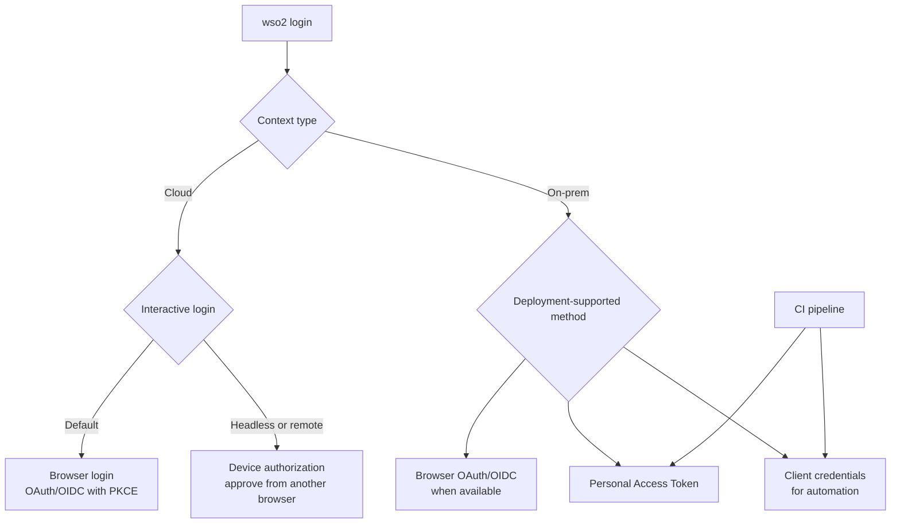

# WSO2 CLI — Product Requirements

**Status:** Working draft  
**Date:** 2026-07-24

## 1. Summary

WSO2 will provide one command, `wso2`, as the common shell for WSO2 product
CLIs. Product teams will continue to own their product-specific commands and
release them independently as WSO2-published modules.

The shell will provide a consistent experience for authentication, contexts,
configuration, help, output, errors, module lifecycle, security, and version
reporting. The first implementation will be written in Go. A shared Go SDK will
make compliant product modules straightforward to build and will provide the
common behavior by default.

## 2. Problem

WSO2 currently ships several product CLIs with different:

- binary and command names;
- command structures;
- login and credential-storage mechanisms;
- context and endpoint configuration;
- help and version behavior;
- structured-output support;
- error formats and exit codes;
- installation and update processes.

A developer using more than one WSO2 product must learn and automate several
different interfaces. Product teams also repeatedly implement the same
cross-cutting CLI features. This makes the experience harder for people, CI
systems, and coding agents.

## 3. Product vision

Users should be able to install one CLI and use a predictable command model
across WSO2 products:

```text
wso2 <product> <resource> <action> [flags]
```

For example:

```shell
wso2 api gateway list
wso2 identity apps list
wso2 integration component deploy --file integration.yaml
wso2 agent projects list
```

Root commands manage capabilities shared across products:

```shell
wso2 login
wso2 whoami
wso2 context list
wso2 module list
wso2 version
wso2 doctor
```

## 4. Goals

### 4.1 Consistent user experience

- Provide one discoverable `wso2` entry point.
- Use consistent command, flag, help, output, error, and exit-code conventions.
- Support both interactive use and deterministic non-interactive automation.
- Present product commands through stable top-level product namespaces.

### 4.2 Shared platform capabilities

- Centralize authentication and secure credential storage.
- Centralize cloud, on-premises, organization, project, region, and endpoint
  context.
- Provide consistent JSON, YAML, and table output.
- Provide stable machine-readable errors and documented exit codes.
- Provide a coherent help tree across the shell and installed modules.

### 4.3 Independent product ownership

- Let product teams own their command implementations and release cadence.
- Avoid compiling every product CLI into the root binary.
- Make product modules easy to author through a shared Go SDK.
- Provide a migration path for existing Go/Cobra CLIs.

### 4.4 Managed module lifecycle

- Discover, install, update, verify, roll back, list, and remove official
  WSO2 product modules.
- Allow modules to be pinned for reproducible CI environments.
- Support pre-installation and signed offline bundles for restricted networks.
- Report the root CLI and module versions without executing arbitrary binaries
  merely to discover their versions.

### 4.5 Secure software supply chain

- Install only WSO2-published modules in the first release.
- Verify publisher authority, signed release metadata, artifact identity,
  digest, provenance, compatibility, and module conformance.
- Prevent silent downgrade and arbitrary `PATH` shadowing.
- Keep long-lived credentials out of product modules.

## 5. Non-goals for the first release

- A marketplace for third-party or community plugins.
- Running product modules as untrusted code.
- Rewriting product business logic inside the root CLI.
- Requiring all product modules to share the root CLI release cadence.
- Unifying the backend APIs of WSO2 products.
- Supporting arbitrary in-process Go plugins.
- Providing a general package manager for non-CLI WSO2 software.
- Guaranteeing an OS-level sandbox for native product modules.

## 6. Users

### Developers and operators

They use multiple WSO2 products interactively and need a consistent,
discoverable command experience.

### CI/CD and platform automation

They need non-interactive authentication, pinned versions, structured output,
stable errors, and offline or pre-installed modules.

### Coding agents

They need predictable help, schemas, machine-readable output, and errors that
describe safe recovery actions.

### WSO2 product teams

They need an SDK, test kit, publishing contract, and independent release flow
that avoid reimplementing common CLI infrastructure.

## 7. Product requirements

Requirements are classified as:

- **P0:** required for the initial usable platform;
- **P1:** required before broad product adoption;
- **P2:** valuable follow-up work.

### 7.1 Root command and namespaces

- **P0:** The installed root command is `wso2`.
- **P0:** Built-in root commands always take precedence over module namespaces.
- **P0:** Each module owns exactly one registered top-level product namespace.
- **P0:** Namespace ownership is validated by the official registry.
- **P0:** The shell resolves modules only from its managed store, never by
  searching arbitrary `PATH` entries.
- **P1:** The shell can suggest installation when a known official namespace is
  not installed.

Initial namespace candidates are `agent`, `api`, `identity`, and `integration`.
The final names will be agreed with the product owners before the public
contract is frozen.

### 7.2 Authentication and credentials

- **P0:** The root shell owns authentication sessions and credential storage.
- **P0:** For a cloud context, plain `wso2 login` starts an OAuth 2.0/OIDC
  Authorization Code flow with PKCE and opens a browser for the user.
- **P0:** For a cloud context on a headless or remote machine,
  `wso2 login --device-code` uses the OAuth 2.0 Device Authorization Grant. The
  terminal shows the verification instructions and the user approves the
  request in a browser on another device.
- **P0:** Device authorization remains an interactive developer login fallback;
  it is not a CI authentication method.
- **P0:** An on-premises context explicitly identifies the product endpoint and
  authentication method. Login uses only mechanisms supported by that
  deployment, such as browser OAuth/OIDC, a personal access token, or client
  credentials.
- **P0:** The CLI does not assume that an on-premises deployment has WSO2 Cloud
  SSO, WSO2 Identity Server, or any other shared identity service.
- **P0:** CI authentication is non-interactive and uses a personal access token,
  client credentials, or a future workload-identity mechanism. CI must never
  start browser login or device authorization.
- **P0:** Interactive long-lived credentials are stored in the OS keychain or
  another approved secure store, not in context files.
- **P0:** CI secrets come from the CI system's secret store, remain only in job
  memory, and are not written to the OS credential store or filesystem.
- **P0:** Modules request short-lived or invocation-scoped credentials through
  the shell's private authentication broker. Audience and scope are restricted
  whenever the deployment's authentication mechanism supports them.
- **P0:** Secret values are never placed in command-line arguments, context
  files, logs, receipts, or module configuration, and are never forwarded to a
  module through its environment. CI may identify a secret-provided environment
  variable or stdin source; the shell reads the value directly into memory.

#### User-facing login decision tree



Contexts contain only the selected authentication method and non-secret
references, such as an opaque secure-store reference or CI variable name.
Credentials and secret values are never stored in a context.

### 7.3 Contexts

- **P0:** A context identifies cloud or on-premises targets and stores only
  non-secret endpoint and resource identifiers.
- **P0:** A context records the selected authentication method and may contain
  only an opaque secure-store reference or the name of a CI-provided variable;
  it never contains a credential value.
- **P0:** On-premises product entries explicitly pair an endpoint with an
  authentication method supported by that deployment.
- **P0:** One context can include multiple product endpoints and product
  sessions.
- **P0:** Users can select a default context or override it for one command.
- **P0:** Context switching does not implicitly authenticate.
- **P1:** Contexts can be imported and exported without credentials.

### 7.4 Output, errors, and help

- **P0:** All compliant modules support `table`, `json`, and `yaml` output
  through the shared SDK.
- **P0:** Non-interactive output is stable and contains no decoration unless
  explicitly requested.
- **P0:** Errors have a stable category, code, message, optional details, and
  recovery suggestion.
- **P0:** Exit codes are defined centrally and tested for conformance.
- **P0:** Secret values are automatically redacted from errors and debug logs.
- **P0:** Root and product help use common templates and terminology.
- **P0:** Modules expose command metadata so the root can discover and summarize
  installed product commands.
- **P1:** The command metadata can be consumed by coding agents and completion
  generators.

### 7.5 Module authoring

- **P0:** A shared Go SDK supplies the mandatory module protocol and common
  behavior.
- **P0:** Authors implement product commands and return typed results or typed
  problems rather than implementing output and error formatting repeatedly.
- **P0:** The SDK integrates naturally with Cobra because the identified WSO2
  product CLIs already use Go and Cobra.
- **P0:** A conformance test kit validates identity, protocol compatibility,
  help, flags, output, errors, authentication use, and secret redaction.
- **P1:** Existing CLIs can migrate incrementally through a compatibility
  adapter, but only fully conformant modules receive the normal verified status.

### 7.6 Module installation and management

- **P0:** Users can list available and installed official modules.
- **P0:** Users can install a module's latest compatible stable version or pin
  an exact version.
- **P0:** Installation is staged and activated only after all verification and
  health checks succeed.
- **P0:** Updates preserve the currently working version until the replacement
  is activated.
- **P0:** The CLI discovers newer compatible module releases through the
  verified catalog and exposes installed and available versions through module
  inventory commands.
- **P0:** Interactive update notices are non-disruptive, appear only after the
  requested command completes, and never contaminate structured standard
  output.
- **P0:** Non-interactive and offline execution does not perform implicit
  catalog network checks or module updates.
- **P0:** Module updates are explicit by default. Automatic module updates,
  when supported, are opt-in and follow the same verification and rollback
  policy as explicit updates.
- **P0:** Users can verify installed modules and roll back to a retained,
  non-revoked version.
- **P0:** CI can disable implicit installation and network access.
- **P0:** CI can pin exact module versions and run without update notices or
  implicit metadata refresh.
- **P0:** A known-revoked active module is not treated as an ordinary available
  update; the CLI reports a security error and blocks execution according to
  the configured revocation policy.
- **P1:** A fresh air-gapped machine can install the root shell and a selected
  set of modules from one signed, platform-specific, self-installing offline
  bundle without a preinstalled `wso2` command or network access.
- **P1:** The offline bundle includes its own verified bootstrap installer,
  exact shell and module artifacts, signed catalog snapshot, manifest, digests,
  signatures, provenance, and required offline trust material.
- **P1:** A connected installation can create a tailored offline bundle for an
  explicit target platform using only compatible releases from the verified
  catalog.
- **P1:** An existing `wso2` installation can inspect and import a transferred
  bundle to add or update modules; this CLI-based import is not required for
  fresh-machine installation.
- **P1:** Individual signed module files and complete offline bundles follow the
  same identity, compatibility, verification, activation, rollback, and
  revocation-metadata policy as online installation.
- **P1:** Organizations can use an approved mirror without changing module
  identity or trust guarantees.

Proposed command surface:

```shell
wso2 module available
wso2 module install api
wso2 module install api@1.8.0
wso2 module list
wso2 module info api
wso2 module update api
wso2 module update --all
wso2 module verify api
wso2 module rollback api
wso2 module remove api
```

The exact distinction between catalog refresh and binary upgrade will be
settled before the command contract is frozen.

### 7.7 Versions

The product must distinguish:

1. the root `wso2` CLI version;
2. the module protocol version;
3. each independently released product-module version.

`wso2 version` must work without network access and report the root version,
protocol version, platform, and installed-module versions. Module inventory is
read from verified receipts rather than by running every module executable.

The CLI may additionally show available versions after an explicit metadata
refresh or network-enabled check.

### 7.8 Security

- **P0:** Registry and release metadata are signed and protected against
  rollback and expiration attacks.
- **P0:** Product-team publishing authority is restricted to assigned
  namespaces.
- **P0:** Every platform artifact has a cryptographic digest, signature, build
  provenance, and software bill of materials.
- **P0:** Installations reject unknown publishers, incompatible hosts,
  incompatible protocols, unsafe archives, modified binaries, and revoked
  releases.
- **P0:** Every launch validates the active module's trusted receipt and
  executable integrity.
- **P0:** Updates use immutable version directories and atomic activation.
- **P1:** The publishing gate includes vulnerability, license, provenance, and
  conformance checks.
- **P2:** Platform-specific sandboxing may be added as defense in depth.

## 8. User experience principles

- Cloud is the default; on-premises targeting is explicit.
- Commands never guess between multiple contexts or products.
- Human-friendly defaults do not compromise deterministic automation.
- Common flags have the same names and meaning everywhere.
- Destructive operations require explicit intent and support non-interactive
  confirmation controls.
- Errors state what failed, why it failed, and the next safe action.
- Automatic module download is opt-in in CI and controllable interactively.

## 9. Initial delivery stages

These stages describe product-level progression, not task order. The
milestones, dependencies, acceptance criteria, and test gates in the
[implementation roadmap](../roadmap.md) are authoritative for delivery
sequence.

### Stage 1 — Foundation

- root command;
- context and secure credential model;
- SDK and module protocol;
- output, error, and help conventions;
- managed module store and receipts;
- signed manifest format;
- conformance test kit.

### Stage 2 — Pilot modules

Migrate two product CLIs with different internal shapes: one whose Cobra root
is already factory-injected and one with more global initialization. This tests
both the preferred SDK path and the migration adapter.

### Stage 3 — Managed distribution

- official catalog and publishing gate;
- update, verification, rollback, revocation, and pinning;
- platform installers;
- signed offline bundles.

### Stage 4 — Product adoption

- migrate remaining agreed product CLIs;
- publish module-authoring guidance;
- deprecation and compatibility guidance for old binary names.

## 10. Success criteria

- A user installs one root CLI and can discover and use multiple product
  namespaces.
- Cloud developer login uses Authorization Code with PKCE by default, while
  headless interactive login succeeds through the explicit device-code
  fallback.
- On-premises login follows the authentication methods declared for the
  selected product endpoint without assuming a shared WSO2 identity service.
- CI authentication completes non-interactively without invoking browser or
  device authorization and without persisting secret values.
- The pilot modules use the root authentication broker and store no long-lived
  credentials.
- The same command result renders as valid table, JSON, and YAML.
- All pilot modules pass the shared output, error, help, security, and protocol
  conformance suite.
- A failed or maliciously modified update cannot replace the active working
  module.
- An installed version can be pinned and reproduced in CI without implicit
  network access.
- Product authors can create a minimal compliant module without implementing
  authentication, output formatting, error formatting, or help templates.
- Root and module versions are reported independently and unambiguously.

## 11. Decisions already made

- The root CLI will be implemented in Go.
- Product functionality remains in independently released modules.
- First-release modules are WSO2-published product modules only.
- The architecture is SDK-first hybrid: managed out-of-process executables plus
  a mandatory module contract and shared Go SDK.
- Shared authentication, output, errors, and help are required behavior, not
  optional conventions.
- The security model assumes trusted WSO2 code backed by a managed publishing
  and verification chain; process separation alone is not treated as a
  sandbox.

## 12. Open decisions

- Final repository and Go module name.
- Final public product namespaces.
- Which two existing CLIs will be the pilot migrations.
- Whether first interactive use may install a known module automatically or
  must ask for confirmation.
- Exact catalog-refresh versus binary-update command terminology.
- Module retention policy and default number of rollback versions.
- Minimum supported operating systems and architectures.
- Registry hosting, signing service, and key-rotation ownership.
- Compatibility and deprecation period for existing standalone CLI names.

## 13. Supporting research

- [Archived original CLI proposal](research/archive/original-proposal.md)
- [Public WSO2 CLI inventory](research/public-wso2-cli-inventory.md)
- [kubectl and Krew architecture research](research/kubectl-krew.md)
- [Azure CLI, AWS CLI, and Google Cloud CLI comparison](research/cloud-cli-comparison.md)
- [Module architecture options](research/module-architecture-options.md)
- [Root CLI installation and distribution](research/root-cli-installation-distribution.md)
- [Research roadmap](../research/roadmap.md)
- [Implementation roadmap](../roadmap.md)
